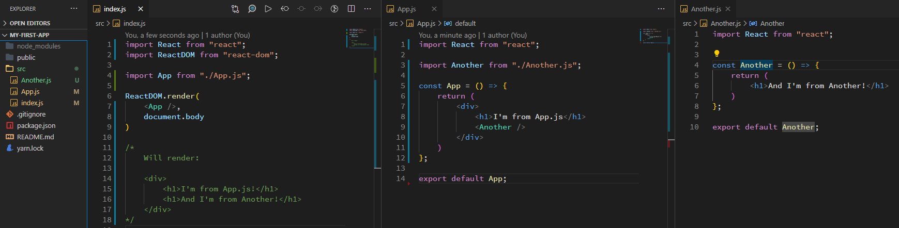
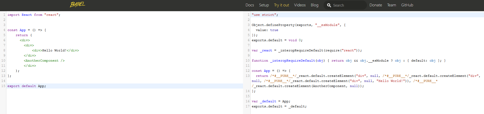
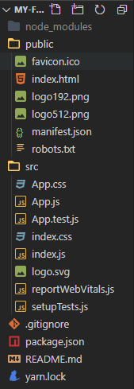

import { Link } from "gatsby";

## What is React?
While we can build websites with vanilla JavaScript (no additional packages installed), there are certain things which make this either difficult or tedious [https://medium.com/dailyjs/the-deepest-reason-why-modern-javascript-frameworks-exist-933b86ebc445]. There are common features to websites which others have already implemented, so why would we spend time creating our own features from scratch every time? You may want an image carousel on your website, however you don't have to spent time working out how to make the internals of it work because <a href="https://www.npmjs.com/package/react-slick">someone else already has</a>. Therefore, we can build upon the work of others to create something we otherwise could not.

![Figure 1 - Various application frameworks (Angular, React, Vue) [https://medium.com/@chsvk/vue-vs-angular-vs-react-in-2019-answered-4ec8dc96e602]](./frameworks.jpg)

**Application frameworks** are a natural extension of this; they create abstractions on top of software to make desired functionality easier to implement, and give us a certain set of criteria to build our app around so we don't have to think of a good way to structure things (this is called the *inversion of control*, for the curious...) [https://en.wikipedia.org/wiki/Software_framework]. Many of these application frameworks exist, each with their own strengths, however one of the most common is the JavaScript framework, **React**. [https://www.npmtrends.com/react-vs-vue-vs-@angular/core]

## How Does React Work?

React will single-handedly deal with everything on the **frontend** of our website (the structure of the webpage, the styling, and the functionality). It is comprised of two parts: 

1. Functionality to create modular pieces of reuseable code, called **components** (*The application part*).
2. Functionality to help us insert our code into the webpage (*The virtual DOM part*).

We install these two parts by importing two packages using `bash÷npm` (**n**ode **p**ackage **m**anager).

```bash
npm install react react-dom
```

### The Virtual DOM Part

The `react-dom` import deals with the creation of a **virtual** DOM. This can be through of as a second layer that sits on top of the **real** DOM on our webpage, almost mirroring it. **Pretty much all the code we write in React will only interact with this virtual DOM**. When we want to actually show the code we have written to a user on our webpage, we have to copy all the changes we made to the virtual DOM into the real DOM. However, we don't have to do this ourselvesas React runs an algorithm to figure out the most efficient way to do this. Updating the virtual DOM is lightning fast, however updating the real DOM is comparitvely like moving through a tarpit; this is why it is more efficient and overall faster to let React handle this updating for us (again for the curious, this process is called <a href="https://reactjs.org/docs/faq-internals.html">*Reconciliation*</a>). [https://twitter.com/Mappletons/status/1103717355392286721/photo/1 , https://reactjs.org/docs/faq-internals.html]. 

![Figure 3 - A visualisation of React's virtual DOM by Maggie Appleton [https://reactjs.org/docs/faq-internals.html]](./reactdom-maggie-appleton.png)

We can begin to use this by using the `js÷ReactDOM` library.

```jsx
import ReactDOM from "react-dom";

ReactDOM.render(
    <h1>You can see me on the webpage!</h1>,
    document.body
);
```

Above, we `js÷import` the `js÷ReactDOM` library, and then use its associated `js÷render()` method to place the `jsx÷<h1></h1>` tag inside the body of our HTML document (in which we would add this JavaScript as a `html÷<script>` tag for instance). This allows us to effectively write almost all our HTML inside our JavaScript file - the stuff we tell `js÷ReactDOM` to `js÷render()` is what we place into the virtual DOM, then React handles the process of updating the actual DOM for us.

### The Application Part

However, the true power (for us, anyway) of React lies in the `bash÷react` import. This is the part of React which deals with point 1 above; it allows us to package up our HTML into **components** - self-contained snippets of JavaScript and HTML. [https://en.wikipedia.org/wiki/React_(web_framework)#Components]

```jsx
import React from "react";
import ReactDOM from "react-dom";

const App = () => {
    return (
        <h1>You can see me on the webpage!</h1>
    )
};

ReactDOM.render(
    <App />,
    document.body
)
```

This is functionally equivalent to what we had before, however now we are telling our webpage to display our *custom* HTML element, `jsx÷<App />` (our *component*), which will `js÷return` the original HTML we had. This is an extremely powerful technique, as it allows us to segment our code into smaller chunks and simply `js÷import` in whatever components we need, when we need them. This concept is known as *modularisation*; splitting up something large into smaller, reusable chunks. [https://learn.co/lessons/react-modular-code] We can take this one step further, and actually begin to separate our code entirely into different files, `App.js` and `index.js`, and just `js÷import` our `jsx÷<App />` from `App.js`.


```jsx
// in App.js
import React from "react";

const App = () => {
    return (
        <h1>You can see me on the webpage!</h1>
    )
};

export default App;


// in index.js
import React from "react"
import ReactDOM from "react-dom";

import App from "./App.js"

ReactDOM.render(
    <App />,
    document.body
)
```

Therefore, we could begin to think of structuring our project by having **each component in a separate .js file**, importing the components we need in each file, and rendering them all in `index.js`.



> **NOTE** - These are merely guidelines! Dan Abramov, a prominent React contributor often seen as an authority on the subject, wrote up a "guide" on how to structure react projects: it only contains the words: <a href="https://react-file-structure.surge.sh/">*"move files around until it feels right"*</a>. If your structure makes sense to you and your peers, then it's correct. [https://mobile.twitter.com/dan_abramov/status/1027248875072114689]

## What's Going On Internally?

Now there's a lot to unpack in this small example, but this is in essence how React works - remember, you're still writing **JavaScript** at the end of the day. Our browsers don't know what `js÷ReactDOM.render()` does, and so when we write this it is actually converted into plain old JavaScript that our browsers *can* understand.

Take for instance our `App.js` file we've mentioned a couple times:

```jsx
// in App.js
import React from "react";

const App = () => {
    return (
        <h1>You can see me on the webpage!</h1>
    )
};

export default App;
```

Before being execute by our browsers, this must actually be converted into an alternative form before they understand what we're trying to do. The converted form that our browser will execute will look something like the following:

```jsx
"use strict";

Object.defineProperty(exports, "__esModule", {
  value: true
});
exports.default = void 0;

var _react = _interopRequireDefault(require("react"));

function _interopRequireDefault(obj) {
    return obj && obj.__esModule ? obj : { default: obj };
    }

const App = () => {
  return (
      /*#__PURE__*/_react.default.createElement(
          "h1", null, "You can see me on the webpage!"
          )
    );
};

var _default = App;
exports.default = _default;
```

Removing some of the fluff that we aren't interested in, we are left with: 

```jsx
const App = () => {
  return (
      /*#__PURE__*/_react.default.createElement(
          "h1", null, "You can see me on the webpage!"
          )
      );
};

var _default = App;
exports.default = _default;
```

While looking different from what we wrote in `App.js`, we can still understand what this might be doing! It seems that our component, `jsx÷<App />`, has been converted into a call to `jsx÷_react.default.createElement()` with the parameters `js÷"h1", null, "You can see me on the webpage!"`. From this, we can probably guess that this function will create a `html÷<h1>` element, and add the text `jsx÷"You can see me on the webpage!"`.

While this example may seem simple, you can imagine this gets out of hand fast:

```jsx
import React from "react";

const AnotherComponent = () => {
	const name = "Josh";
  	return(
    	<div>
            <span>Hello, {name}</span>
      	</div>
    );
};

const App = () => {
    return (
      <div>
        <div>
        	<div>Hello World!</div>
      	</div>
      	<AnotherComponent />
    </div>
    );
};

export default App;
```
Adding in another component, `jsx÷<AnotherComponent />` and adding in the variable `js÷name` leads to the following *monstrosity*:

```jsx
"use strict";

Object.defineProperty(exports, "__esModule", {
  value: true
});
exports.default = void 0;

var _react = _interopRequireDefault(require("react"));

function _interopRequireDefault(obj) { return obj && obj.__esModule ? obj : { default: obj }; }

const AnotherComponent = () => {
  const name = "Josh";
  return /*#__PURE__*/_react.default.createElement("div", null, /*#__PURE__*/_react.default.createElement("span", null, "Hello, ", name));
};

const App = () => {
  return /*#__PURE__*/_react.default.createElement("div", null, /*#__PURE__*/_react.default.createElement("div", null, /*#__PURE__*/_react.default.createElement("div", null, "Hello World!")), /*#__PURE__*/_react.default.createElement(AnotherComponent, null));
};

var _default = App;
exports.default = _default;
```

or, more "simply":

```jsx
const AnotherComponent = () => {
  const name = "Josh";
  return /*#__PURE__*/_react.default.createElement("div", null, /*#__PURE__*/_react.default.createElement("span", null, "Hello, ", name));
};

const App = () => {
  return /*#__PURE__*/_react.default.createElement("div", null, /*#__PURE__*/_react.default.createElement("div", null, /*#__PURE__*/_react.default.createElement("div", null, "Hello World!")), /*#__PURE__*/_react.default.createElement(AnotherComponent, null));
};

var _default = App;
exports.default = _default;
```

Notice how we end up with multiple nested calls to `jsx÷_react.createElement()`? This would be horrible to write and debug, and is not very clear in what the end result will actually *look* like. 

## JSX
It's no suprise, therefore, that when we write code in our React project, we *don't* use the `jsx÷_react.default.createElement()` function. Instead, we use that **alternate syntax** we used before - syntax I have hitherto **incorrectly** been calling "HTML".

```jsx
const App = () => {
    return _react.default.createElement("h1", null, "Hey")
}; // We don't do that here

const App = () => {
    return <h1>Hey</h1> // We do this instead
};
```

This syntax looks almost *exactly* like HTML - however, it is actually **JSX** (meaning, **J**ava**S**cript **X**ML). Functionally it behaves the same as HTML in most cases, however, as eluded to before, we can write JavaScript code *inside* JSX using the `{ }` syntax. [https://reactjs.org/docs/introducing-jsx.html]

```jsx
const App = () => {
    const name = "Josh"
    return (
        <h1>
            Hey, I'm { name } and I'm { new Date().getFullYear() - 1997 } years old!
        </h1>
    ) // "Hey, I'm Josh and I'm 23 years old"
};
```

We don't worry about converting JSX into a language that browsers understand (remeber those `js÷_react.default.createElement()` calls?), as we use a library called <a href="https://babeljs.io/repl">*Babel*</a> to do this for us (once again for the curious, this process of converting code is called *transpiling*). This is what I used to create those ugly functions above - give it a shot! Take some of the JSX examples shown here or online, and convert them into non-JSX form to see how much easier Babel and React are making it for us![https://babeljs.io/repl]



## Making a React Application with Create React App
> So we need `react`, `react-dom`, and `babel`. Then we probably need `webpack` too. And a server to run it on so `webpack-dev-server`... This is starting to get out of hand...

**Cue `create-react-app`!** **C**reate-**R**eact-**A**pp (CRA) does all the heavy lifting for us when it comes to creating React projects. It installs all the dependencies we'll need for us, it starts up a server to host our React app, creates a bunch of starter files, and populates our `package.json` with various **scripts**, such as `start` which will open up our react project so we can actually see what we've done! [https://create-react-app.dev/docs/getting-started/]

To get started with this, we have to install and run `create-react-app` - to do this in one step we can run 

```bash
npx create-react-app name-of-project
```

where `npx` means "install with **np**m and then e**x**ecute". Now, this will take 3/4 minutes to finish running because there is just so many dependancies and things to set up. Luckily, we don't have to do any of this! A simple `Hello, world!` -type application is about **185Mb** in size. The majority of that is taken up by the `node_modules` folder, which is where all the dependencies such as `babel` and `react-dom` are stored.



We don't have to worry about most of this, however it should be noted that we will place the majority of our files inside the `src` folder. There is also a `public` folder, in which is kept our `index.html`. Inspecting this `index.html` will reveal an extremely short file, consisting mainly of overhead with a single interesting line:

```html
<div id="root"></div>
```

Inspecting the `index.js` within the `src` file will also reveal a clue as to why this empty `div` exists.

**index.js**
```jsx
import React from 'react';
import ReactDOM from 'react-dom';

import App from './App';


ReactDOM.render(
    <App />,
    document.getElementById('root')
);
```

What this `jsx÷ReactDOM.render()` function is doing is taking everything defined in `App`, and shoving it into that `<div>` with an id of `jsx÷"root"`. [https://reactjs.org/docs/rendering-elements.html] We could think of this as simply:

```html
<div id="root">
    <!-- Everything in App gets put in here -->
</div>
```

Therefore, let's create an `App.js` file which will return a `jsx÷<div>` containing the text `jsx÷"Hello, world!`.

**App.js**
```jsx
import React from "react";

const App = () => {
    return (
        <div>Hello, world!</div>
    );
};

export default App;
```

React will render this inside our `index.html`, such that the end result will be:

```html
<!-- Stuff above -->
<div id="root">
    <div>Hello, world!</div>
</div>
<!-- Stuff below -->
```

That is all React is doing. It looks like magic, and the inner workings of it certainly are, but in reality the concept is relatively simple:

> **Write all your HTML (note: *JSX* ) inside JavaScript files, and render them all within a single `jsx÷<div>` in `index.html`.**

Now, when we have many components all nested within each other, `props` flying around, `state` to worry about, and various other libraries inserting and deleting things (`react-router`, `redux`, `axios`...) this can get extremely complicated, but at the end of the day this is at the core of how React works.

## Components Revisited
Components form the building blocks with which we make React applications. Think of them as the bricks you use to make a house. For instance, `jsx÷<App />` above is a component. Components come in **two** flavours: *Class Components* and *Function Components*.

### Class Components

We shall start with **Class components**, however note there has been a shift towards **function** components in recent years for reasons that we will discuss later. A class component, as you'd think, is defined as a `js÷class` in JavaScript (we shall leave discussions of why these technically *aren't* classes for another day!). [https://www.twilio.com/blog/react-choose-functional-components]

```jsx
import React from "react";

class App extends React.Component {
    render(){
        return <div>Hello, world!</div>
    };
};

export default App;
```

We state that `js÷App` shall be a class with the `jsx÷class App` line, and then say that it will `jsx÷extend` another class defined in the `jsx÷React` library called `jsx÷Component`. This means that our class, `jsx÷App`, will have access to all the methods and properties the smart guys at Facebook placed into the `jsx÷React.Component` class. It has a `js÷render()` method (the inner workings of which is defined in `jsx÷React.Component`), from which we `js÷return` the JSX we want to display to the user. This `js÷render()` method will be called whenever a component is told to **render** to the webpage - a topic we shall cover shortly.

We can assign other methods or properties to our class too - though we don't need to use a **declaration** to do so (no need to say `let`, `const` or `var` when defining a new method or property).

```jsx{}
import React from "react";

class App extends React.Component {
    name = "josh";

    age = 23;
    
    render(){
        return (<div>Hello, I'm {name} and I'm {age} years old!</div>)
    };
};

export default App;
```

**NOTE** - The above *seems* like it should output

```html
<div>
    Hello, I'm josh and I'm 23 years old!
</div>
```

**However**, if you try to run this you might be faced with an error. When we create an instance of our class component, we are creating an `Object`. As such, when we attach properties/methods to it, such as `name` above, we never *declare* them to JS. For example, when we say :

```javascript
const name = "Josh"
```
in our JS code, we are saying "Hey JS, please set aside some space in memory, label it 'name' and store inside it the value `js÷"Josh"`".


If we tried to do the same thing on an `js÷Object`:

```javascript
const obj = {
    name: "Josh",
    sayName() {
        console.log(name)
    }
};

obj.sayName();
```
we are saying "Hey JS, set aside some space in memory, call it `obj` and place into it a section called 'name' which stores `js÷"Josh"`. Also place into it a function which will log out a variable called 'name'. Oh, what's name? Just go into memory and.... oh". We never store `js÷name` in global memory, only within `jsx÷obj`. We haven't yet finished setting aside that memory yet, so we can't access it! Without delving too deep into how classes and the `js÷class` keyword function in JavaScript, let's just say this: 

> **When we want to access properties associated with a `js÷class` we prefix the property with a value called `js÷this`**. [https://developer.mozilla.org/en-US/docs/Web/JavaScript/Reference/Operators/this]

```jsx
import React from "react";

class App extends React.Component {
    name = "Josh";
    
    render(){
        return (<div>Hello, {this.name}!</div>)
    }; // Hello, Josh!
};

export default App;
```
*This* (Pun intended) is the correct code that will output:

```html
<div>
    Hello, josh!
</div>
```

Similarly, we would need to reference `js÷this` when calling a method defined in our class component, because classes in JavaScript are actually `js÷Objects` under the hood. [https://developer.mozilla.org/en-US/docs/Web/JavaScript/Reference/Classes]

```jsx
import React from "react";

class App extends React.Component {
    name = "josh";

    age = 23;

    printAge = function () {
        console.log(this.age)
    }
    
    render(){
        this.printAge(); // 23
        return (<div>Hello, {this.name}!</div>);
    };
};

export default App;
```

Here, we define a `js÷printAge()` method on the class `js÷App` which will print `js÷this.age`, and we call it within our `js÷render()` method. 

### Function Components

**Function** components avoid the usage of `js÷this`, and are instead treated as... well, **functions**: we can define functions within them, define variables within them, and call them all without having to worry about `this` as we are actually declaring variables. Here is a function component version of the above `js÷App` which will behave in the same way.

```jsx
import React from "react";

const App = () => {
    const name = "josh";
    const age = 23;

    const printAge = () => {
        console.log(age)
    };

    printAge();

    return(<div>Hello, {name}!</div>)
};

export default App;
```

Notice a few differences:

1. We do not extend `js÷React.Component` as we have no need to access the `js÷render()` method - we simply return from the function what we want to render. 
2. We define it as a function instead of a class (hence the name *function component*).
3. We define properties and methods as we would in normal JavaScript - with a declarative statement `js÷let`, `js÷const` or `js÷var`.
4. We call `printAge()` within the function body itself - this is because the entire function is run again when the component is called to re-render itself (more on this later), as compared to the `js÷class` component where only code written in the `js÷render()` method would be run after initialization.
5. Lastly, and perhaps most importantly, **no faffing about with `js÷this`** *(can you tell im biased?)*.

### Rendering a Component
A quick aside - I've mentioned *render* quite a few times so far. Rendering is when we convert the JSX we return from our components into HTML to be placed into the webpage. Remember that stuff about a **virtual DOM**? Well *rendering* is the process of updating nodes in the real DOM to match that of the virtual DOM. This means that our JS will be run, and the resulting JSX will be displayed to the screen by being put into that `jsx÷<div id="root">` mentioned previously. React decides when to *re-render* a component, usually when a user visits a page which we specify needs to display a certain bit of JSX, or when our **state/props** updates - more on this... Now!

## Props - READ FROM HERE MOST DONE BUT DOUBLE CHECK
Now, as vain as I am, it would be nice if people could write their *own* name and age within our component. This is simplified for us (once again) by React, as React will automatically pass an object called `jsx÷props` to our components. For instance, in our `index.js` where we call our `jsx÷ <App />` component, we can pass down a variable by using that JSX syntax again:

**index.js**
```jsx
import React from "react";
import ReactDOM from "react-dom";

import App from "./components/App";

ReactDOM.render(
    <App userName={"Emily"} age={19} />,
    document.querySelector("#root")
);
```

This will attach the `js÷userName` and `js÷age` properties to the `js÷props` object that React passes down whenever we call a component. We access this within `App` by passing the the `props` component into our function declaration.

**App.js**
```jsx
import React from "react";

const App = (props) => { // props = { userName: "Emily", age: 19 

    const printAge = () => {
        console.log(props.age)
    };

    printAge(); // 19

    return(<div>Hello, {props.name}!</div>) // Hello, Emily!
};

export default App;
```

This allows us to access all the properties placed onto props when `js÷App` is called. We could even add another object to this, for instance:

**index.js**
```jsx
import React from "react";
import ReactDOM from "react-dom";

import App from "./components/App";

ReactDOM.render(
    <App person={ {name: "Emily", age: 19} } />,
    document.querySelector("#root")
);
```

```jsx
import React from "react";

const App = (props) => { // props = { person : { name: Emily, age: 19 } }
    const name = props.person.name;
    const age = props.person.age

    const printAge = () => {
        console.log(age)
    };

    printAge();

    return(<div>Hello, {name}!</div>)
};

export default App;
```

Notice the `{ {} }` syntax when passing an object into JSX (`jsx÷ person= { {name, age} }`) - one set of curly braces for declaring a JS expression, a second set to declare the object.

Class components treat things differently - we do not have a function declaration to access the `props` object, but luckily React passes this to our class for us, and so we can immediately access it using the `js÷this.props` syntax, however everything else remains the same as it was in with functional components - the only difference is *how* we access the props object.

**index.js**
```jsx
import React from "react";
import ReactDOM from "react-dom";

import App from "./components/App";

ReactDOM.render(
    <App name={"Emily"} age={19} />,
    document.querySelector("#root")
);
```

**App.js**
```javascript
import React from "react";

class App extends React.Component {

    printAge = function () {
        console.log(this.props.age) // 19
    }
    
    render(){
        this.printAge();
        return (<div>Hello, {this.props.name}!</div>)
    };
};

export default App;
```

## State
State is why class components were needed for so long, and why functional components were second choice for most of React's lifetime. Now we have **Hooks** which eliminates this somewhat, however let's start from the beginning.

We can pass some information down into a component via `props`. Wouldn't it be great if we had some way of continually feeding information to a component, *from* the component itself? What if we could keep track of some changing variable **on** the component itself? An example might be a simple counter.

```jsx
import React from "react";

const Counter = () => {
    let count = 0;

    return(
        <div>
            <h1>The count is: {count}</h1>
            <button onClick={/* Increment the count upon click */}></button>
        </div>
    );
};

```
Okay this looks good, so after we click we then need to re-run our function to display the new `js÷count`-- oh wait!

```javascript
let count = 0; // This line would reset our count again upon re-rendering
```

We are then left in a stalemate - either we re-render our component to display the new count, promptly resetting it to `0`, or we do not re-render our component. `count` would increase, however our component would **NOT** re-render and display the new `count`. To get around this tricky scenario, we need to introduce a new concept in React called **state**.

The way we add this in to a `js÷class` component is a bit convoluted, so we'll go through it slowly.

```jsx
import React from "react";

class Counter extends React.Component {
    constructor(props){

    };
    
    render(){
        return (<div></div>)
    };
};

export default Counter;
```
The first thing we do is to add a `constructor` function to our component, and feed in our `props`. This constructor is called when the `Counter` is first instantiated (when `<Counter />` is **first** called), however **not** when it is re-rendered. This means we can initialize our `count` to be `0` without having to worry about resetting it on every re-render. Next, we call a built-in function called `super` passing in our props:

```jsx
import React from "react";

class Counter extends React.Component {
    constructor(props){
        super(props);
    };
    
    render(){
        return (<div></div>);
    };
};

export default Counter;
```

`super` is a built-in function to JavaScript which will allow us to access all the properties and methods on the **parent class** of `js÷Counter` (which would be `js÷React.Component`). Without this call to `js÷super(props)`, we would lose access to `js÷render()` and other methods defined therein. Now we finally get on to adding `state`:

```jsx
import React from "react";

class Counter extends React.Component {
    constructor(props){
        super(props);
        this.state = {count : 0}
    };
    
    render(){
        return (<div></div>)
    };
};

export default Counter;
```
We assign `js÷this.state` to an object, wherein we can begin to define the things we want to keep track of within our component.

### The Unavoidable 'This'

Great! Now we have access to `state` on our component, and can begin to work on the `js÷increment()/decrement()` functionality. We use the *event handler* called `jsx÷onClick={}`, which is an attribute we can attach to a JSX button; it literally means "when someone clicks on this, execute whatever is in the brackets. So, simple right?

```jsx
import React from "react";

class Counter extends React.Component {
    constructor(props){
        super(props);
        this.state = {count : 0}
    };

    increment(){
        this.state.count++;
    };

    decrement(){
        this.state.count--;
    };

    render(){
        return(
            <div>
                <h1>The count is: {this.state.count}</h1>
                <button onClick={this.increment}></button>
                <button onClick={this.decrement}></button>
            </div>
        );
    };
};
App.render().increment()
```
**NB** - we pass a *reference* to `increment`/`decrement` instead of calling the function, this is because we want `onClick` to be synonymous with `this.increment()`. Passing `this.increment()` would assign `onClick=` to be the **return** result of `increment`, which is **nothing**.

Well here's where things get a little more finicky. Remember `this`? `this` refers to the current **execution context**. When we enter a function, we create a **new** execution context, and so our `this` refers to the execution context *in which the function was called*. [https://developer.mozilla.org/en-US/docs/Web/JavaScript/Reference/Operators/this] A simple way to think of `this`:

> **`jsx÷this` refers to *some* `jsx÷Object`; which `jsx÷Object` depends on where the code is being executed from.** [https://reedbarger.com/why-we-need-this-in-javascript-and-how-to-know-its-value/]

When there is no `jsx÷Object` attached to where we are when we execute our code, `jsx÷this` defaults to ne the `jsx÷global` object, which, as it's name suggets, is an object visible to **everything** in our application. This `jsx÷global` object is where functions like `js÷setTimeout` are defined, and why we can use them in the top-level of our code. [https://developer.mozilla.org/en-US/docs/Web/JavaScript/Reference/Global_Objects/globalThis] Footnote - having Window, global, globalThis is annoying

```jsx
setTimeout(() => console.log("hi"), 1000)
```

is just **shorthand** for:

```jsx
global.setTimeout(() => console.log("hi"), 1000);
```

Things get more complicated when we start introducing **other** `jsx÷Objects` into our code (such as the `jsx÷class Counter` above).

```javascript
function func (){
    console.log(this);
};

const obj = {
    inside: func
};

func() // Called from the global scope, therefore `this` = `global` object

obj.inside() // inside() is equivalent to calling func(), therefore `this` = {inside: [Function: func]} as we are executing directly from obj
```

To further explain why this can give different values, let's assign each calling context a variable.

```javascript
function func(){
    console.log(this.num);
};

global.num = 5;

const obj = {
    num: 10,
    inside: func
};

func(); // Called from `global` therefore `this.num` = `global.num` = 5;
obj.inside() // Called from `obj` therefore `this.num` = `obj.num` = 10;
```
Notice how `jsx÷this.num` will log out a different value depending on where we called it from? Now, when we enter a new function we enter a **new** execution context, and `jsx÷this` gets set to the `jsx÷global` object by default. To illustrate this a little further, let's say we instead call `js÷func()` from inside a `js÷function` in `js÷obj`.

```javascript
function func(){
    console.log(this.num);
};

global.num = 5;

const obj = {
    num: 10,
    inside(){
        func();
    } 
};

func(); // Called from `global` therefore `this.num` = `global.num` = 5;
obj.inside() // ???
```
What happens when we call `js÷obj.inside()`? Well, when we enter a function we enter a new execution context (because `js÷funcions` are also `js÷Objects` in JavaScript), therefore we get a new `this`. A good rule of thumb :

> **Look to the left of the `.` and you'll be right most of the time**.

Let's walk through the logic in that manner: `js÷obj.inner().func()`. So in `obj`, `this` = `global`. In `inside()`, `this` = `obj`. In `func()`, `this` = `inside()` which is a function, therefore `this` = `global`. Therefore, we get `5` as our answer!

```javascript
function func(){
    console.log(this.num);
};

global.num = 5;

const obj = {
    num: 10,
    inside(){
        func();
    } 
};

func(); // Called from `global` therefore `this.num` = `global.num` = 5;
obj.inside() // 5 
```

Looping back to our current issue, we are trying to do `js÷Counter.render().onClick().increment()`. By following our `.` rule, we can trace what might be happening with `this`. On `Counter`, `this` = `global`. in `render()`, `this` = `Counter` (what we want). In `onClick()`, `this` = `undefined` (`onClick` is technically not a method, so `this` doesn't default to `global` here). Therefore, when we call `this.increment()` within `onClick`, we are calling `increment()` with `this` = `undefined`. Therefore it's no suprise that this doesn't work as expected!

 To fix this, we need to do **one of two things**:

**1) Bind `this`.**

 This involves telling our class `Counter` that, whenever we call `increment`, we want to retain the current execution context (which, as we execute our constructor, is `Counter`):

```jsx
 class Counter extends React.Component {
    constructor(props){
        super(props);
        this.state = {count : 0}
        this.increment = this.increment.bind(this);
        this.decrement = this.decrement.bind(this);
    };

    increment(){
        this.state.count++;
    };

    decrement(){
        this.state.count--;
    };

    render(){
        return(
            <div>
                <h1>The count is: {this.state.count}</h1>
                <button onClick={this.increment}></button>
                <button onClick={this.decrement}></button>
            </div>
        );
    };
};

```
Now that's a lot of `this` flying about, but remember `this` refers to whatever the context is of **when we are running the code**: upon reaching `this` in the constructor, our context is the `Counter`. The line

```javascript
this.increment = this.increment.bind(this);
```

will tell our Counter to always use the execution context of the `Counter` whenever we call `increment`, *regardless of where we call `this.increment()`*. But binding `this` is a strange behavior and difficult to grasp, and I'm sure I've said `this` enough times for it to lose its meaning by now. The amount of **bolding** and *italics* in those last couple paragraphs should make clear just how easy it is to get confused when talking about the `this` object in JS, and how hard it can be to explain. So, we can do option 2 instead:

**2) Use arrow functions**

Remember I mentioned that arrow functions were slightly different to normal function declarations? The reason is because arrow functions **do not have a `this`**. Entering a normal function, we enter a new execution context and therefore have a new `this`. When entering an arrow function, however, as happens with any variable in javascript (see *lexical scoping*), when we call `this` in an arrow function JS will look within our function and check "do you define a variable called `this`?", and when it doesn't find one it goes up to the next outer function/object/block and checks "do YOU have a `this` variable?". This keeps going up the scope chain until a `this` is found. Therefore, we can instead say: 

```jsx
 class Counter extends React.Component {
    constructor(props){
        super(props);
        this.state = {count : 0}
    };

    increment(){
        console.log(this.state) // { count: 0 }
        this.state.count++;
    };

    decrement(){
        this.state.count--;
    };

    render(){
        return(
            <div>
                <h1>The count is: {this.state.count}</h1>
                <button onClick={() => this.increment()}></button>
                <button onClick={() => this.decrement()}></button>
            </div>
        );
    };
};

```
Using our `.` rule for `Counter.render().onClick().increment()`: in `Counter`, `this` = `global`. In `render()`, `this` = `Counter`. `onClick` is an arrow function, and so doesn't redefine `this`, therefore `this` is the same as it was in `render`. Therefore, when we call `this.increment()` within `onClick`, it's like calling `this.increment()` from within `render()`, which we just showed was `Counter`!

There we go, we've overcome the `this` hurdle of this Counter!

**BUUUUUUUT** there's one more issue. If you take this code and try and run it, nothing will happen upon clicking the buttons. Nada. Zip. Ziltch. Your IDE might even throw a big red line under your code and tell you *"Don't mutate state directly"*. This goes back to the whole point of why we needed to use a class in the first place: we want to keep track of a variable called `count` *and re-render our component while keeping this updated variable and display its new value*. Directly touching `this.state` will update the `count` variable, but it will **not** re-render the component. Luckily, the smart React guys solved this for us - on that `React.Component` class we extend from, they define a method called `setState` which we use to mutate the state of our `Counter`. The reason being is that `.setState()` will cause a re-render of our Counter **after** our state is updated! We access it with `this.setState()` and pass in the updates we want to make: 

```jsx
 class Counter extends React.Component {
    constructor(props){
        super(props);
        this.state = {count : 0}
    };

    increment(){
        this.setState({count: this.state.count + 1});
    };

    decrement(){
        this.setState({count: this.state.count - 1});
    };

    render(){
        return(
            <div>
                <h1>The count is: {this.state.count}</h1>
                <button onClick={() => this.increment()}></button>
                <button onClick={() => this.decrement()}></button>
            </div>
        );
    };
};

```
**NB** - we only have to specify the values in state we wish to change, if we had more properties in our `state` we do not have to mention them when updating the `state` of `count`.

Finally, the above will work (although those buttons might be a bit small, let's add some text to them):

```jsx
 class Counter extends React.Component {
    constructor(props){
        super(props);
        this.state = {count : 0}
    };

    increment(){
        this.setState({count: this.state.count + 1});
    };

    decrement(){
        this.setState({count: this.state.count - 1});
    };

    render(){
        return(
            <div>
                <h1>The count is: {this.state.count}</h1>
                <button onClick={() => this.increment()}>Increment</button>
                <button onClick={() => this.decrement()}>Decrement</button>
            </div>
        );
    };
};

```
There we have it - the above is a functioning class-based counter component. Try it for yourself; replace your `index.js` file in the `src` directory of a CRA project with the following, and you too can have a cool little  `Counter` app.

**index.js**
```jsx
import React from "react";
import ReactDOM from "react-dom";

 class Counter extends React.Component {
    constructor(props){
        super(props);
        this.state = {count : 0}
    };

    increment(){
        this.setState({count: this.state.count + 1});
    };

    decrement(){
        this.setState({count: this.state.count - 1});
    };

    render(){
        return(
            <div>
                <h1>The count is: {this.state.count}</h1>
                <button onClick={() => this.increment()}>Increment</button>
                <button onClick={() => this.decrement()}>Decrement</button>
            </div>
        );
    };
};

ReactDOM.render(
    <Counter />,
    document.querySelector("#root")
);

```

## Summary
We covered a lot of really heavy stuff, so I implore you to look for other resources and explanations. We covered the difference between class and functional components, how react works under the hood, the structure of a react app in CRA, props, and state.

 What we did **not** cover was using `state` in functional components. This is because this would necessitate an explanation of the **hooks** system, released in *React 16.8* in 2019, and this post has been long enough already. Rest assured, hooks are **great** and, in my opinion, much easier to understand than all the `this` tomfoolery using a `class` component. We also neglected the entirety of **lifecycle methods** like `componentDidMount` and `componentDidUpdate`. These would also necessitate their own post.
 
 A few resources to learn from: the [official react documentation](https://reactjs.org/docs/getting-started.html) is a *fantastic* resource to learn from too, the counter example is almost the same as the one defined there in their "Getting Started" page. The ReactJS [subreddit](https://www.reddit.com/r/reactjs/) is also great for reading around the subject. Stephen Grider's [Modern React](https://www.udemy.com/course/react-redux/) course on Udemy is also brilliant for initial learning, although you might have to wait for a deal on Udemy to get it for ~£10 (the sales come by very frequently so keep an eye out).