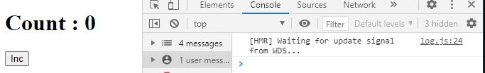
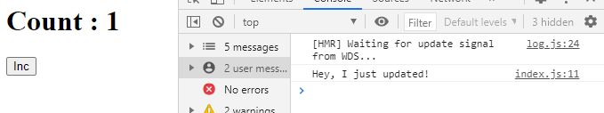

## TL;DR
![Figure 1 - The three lifecycle stages of a React component, and their associated lifecycle methods. [1]](/lifecycle-diagram.JPG)

> There are **three** main component lifecycle stages, each with their own functions that run at each stage (lifecycle methods):
1. **Mounting**: The process of inserting our JSX into the DOM. The lifecycle method order is  `jsx÷constructor()` -> `jsx÷render()` -> `jsx÷componentDidMount()`.
2. **Updating**: Re-rendering our component with new information based on new `jsx÷props` or `jsx÷state`. The lifecycle method order is `new props/state` -> `jsx÷render()` -> `jsx÷componentDidUpdate()`.
3. **Unmounting**: Where we clean up any network listeners or recurring events. The only lifecycle method associated with it is `jsx÷componentWillUnmount()`.

## Lifecycle Methods
Every component we make in React, functional or class-based, has a certain series of stages it goes through; this series of stages is called the  **lifecycle** of a component. [[2]](https://medium.com/react-ecosystem/react-components-lifecycle-ce09239010df) Each stage in a components lifecycle has particular functions which are run during them; these are called **lifecycle methods**. Remember when we define a `jsx÷class` component, we `jsx÷extend` a `jsx÷React.Component`?

```jsx
import React from "react";
class App extends React.Component{
    ...
};
```
Well one of the reasons is because it gives us access to specific *methods* defined on `jsx÷React.Component`. [[3]](https://reactjs.org/docs/react-component.html) These specific methods are the titular **lifecycle methods**. `jsx÷render()` is an example of one of these methods, as is `jsx÷constructor()` to a certain extent!

```jsx
import React from "react";
class App extends React.Component{
    render(){
        return (
            <div>
                Render is a lifecycle method!
            </div>
        )
    };
};
```

```jsx
import React from "react";
class App extends React.Component{
    constructor(props){
        super(props);
        this.state = { name: "josh" };
    };
    render(){
        return (<div>So is constructor!</div>)
    };
};
```

## Lifecycle Stages and Methods

![Figure 2 - The standard lifecycle stages of a human. [2]](./lifecycle-stages-2.jpeg)

These lifecycle methods will run at different stages during a component's lifecycle, hence the name. Let's dive into the **three** main stages of component lifecycle in react: *Mounting, Updating, and Unmounting*! [[1]](https://projects.wojtekmaj.pl/react-lifecycle-methods-diagram/)

### Mounting
During the *Mounting* phase, we do some initial setup for our component before our component is rendered to the screen for the first time. Mounting is the process of adding a *node* (an HTML element) to the (real) DOM and showing the component to the user. Think of this as a stage magician about to perform: he first enters the stage behind a curtain sets everything in place for his performance (`jsx÷constructor()`), then the curtain is lifted and the stage is revealed to the audience (`jsx÷render()`), after which the magician will perform his first magic trick (`jsx÷componentDidMount()`). These are the steps involved in the mounting process: we do initial setup with our `jsx÷constructor()`, we then `jsx÷render()` a `React element` into a `DOM node` which is inserted into the DOM. After which we run another lifecycle method called `jsx÷componentDidMount()`. Let's run through each of the methods associated with the *mounting* stage. [[3]](https://reactjs.org/docs/react-component.html)

#### 1. constructor()

The first step in our component lifecycle is to first do the initial setup for it (e.g - set up `jsx÷state`). This is done in the `jsx÷constructor()` function, which is the first of our *lifecycle methods*. The constructor method will run when a component is first initialized. [[4]](https://developer.mozilla.org/en-US/docs/Web/JavaScript/Reference/Classes/constructor) Note - there are only **two** reasons to use a `jsx÷constructor()` in your component:

1. You initialize **state**.
2. You **bind** methods. 

> **If you don't do either of these, your component does not need a constructor and you can skip this lifecycle method.** [[5]](https://reactjs.org/docs/react-component.html#constructor)

**index.js**
```jsx
import React from "react";
import ReactDOM from "react-dom";

import App from "./components/App";

ReactDOM.render(
    <App />, // App first declared here, so constructor will be run at this point
    document.querySelector("#root")
);

```

**App.js**
```jsx
import React from "react";
class App extends React.Component{
    constructor(props){ // Before component is rendered, constructor function runs to setup state
        super(props);
        this.state = {name: "josh"};
    };
    render(){
        return (
            <div>
                So is constructor!
            </div>
        )
    };
};

export default App;
```


#### 2. render()

The `jsx÷render()` method will insert our JSX into the *virtual DOM* (technically it is firstly transpiled into calls to `jsx÷React.createElement()`). To rephrase - all the code (JSX) we `jsx÷return` from our `jsx÷render()` method will be inserted into the virtual DOM (insertion into the *real* DOM is performed by the `jsx÷ReactDOM.render()` method). This is needed during *mounting* as, once we have instantiated our components with any `jsx÷state` needed, we need to tell React that we want them to be shown to the user. [[6]](https://reactjs.org/docs/react-component.html#render)

```jsx
import React from "react";
class App extends React.Component{
    render(){
        return (
            <div>
                This JSX div is returned from render, so it will be converted to a DOM node and placed into the DOM.
            </div>
        )
    };
};

export default App;
```

#### 3. componentDidMount()

This final method during the *mounting* stage runs right after the component is **successfully** mounted to the virtual DOM. This makes the `jsx÷componentDidMount()` method a great place to setup initial data, such as creating a network request to retrieve some data to populate `jsx÷state`. [[7]](https://reactjs.org/docs/react-component.html#componentdidmount)

```jsx
import React from "react";
class App extends React.Component{
    constructor(props){
        super(props);
        this.state = {data: ""};
    };

    componentDidMount(){
        let dataFromNetwork = getDataFromThisUrl("https://exampledata.com/api/post/1");
        this.setState({data: dataFromNetwork});
        // Note - data fetching is asynchronous, and so this would NOT work. However, this illustrates the usage of componentDidMount nicely without getting bogged down with details such as callbacks, promises, or asynchronous JavaScript
    };

    render(){
        return (<div>Here's the data: {this.state.data}</div>);
        // Blank string initially, when this.setState runs it will update the this.state.data value and re-render the component to display the new data.
    };
};
```

Rightly you may be thinking *"couldn't we just load initial data like that into the constructor instead?"* Well, you *can*...

```jsx
import React from "react";
class App extends React.Component{
    constructor(props){
        super(props);
        this.state = {data: getDataFromThisUrl("https://exampledata.com/api/post/1")};
            // Again, we are skipping over callbacks, promises, and asynchronous JavaScript.
        }};
    };

    render(){
        return (<div>Here's the data: {this.state.data}</div>)
    };
};
```

Here we assign the initial value of `jsx÷this.state.data` to be the `jsx÷return` value from a function which makes a network request. This is perfectly valid, however is often avoided for **three** reasons:

1. Our component may mount **before** the network request finishes, meaning our value for `jsx÷this.state.data` will *not be there yet*. Furthermore, we aren't calling `jsx÷this.setState` to update our `jsx÷this.state.data`, and so our component won't re-render to display the data retrieved from the network.

2. It's useful to have our component always start from some initial state every time it's initialized, so our `jsx÷constructor()` should always give the **same output for a given input every time**. Introducing network requests here would prevent that, as we can't guarentee the component will always start from the same point every time. 

3. Remeber we specified that `jsx÷componentDidMount()` only runs after a component is *successfully* mounted? Our component may **fail to mount**. In that case, we wouldn't want to make our network request - for a slightly contrived example for this, let's say we need to make 10 network requests for each component, and we render 10 of these components to the user. Something went wrong, and now each of the components fail to mount, however the network request was made in the `jsx÷constructor()` function which occurs at initialization of a component, before it is mounted. The constructor doesn't care that the component failed to mount, it will go ahead and make that request. Therefore we make 100 network requests which are useless as the user will never see their result, which could end up costing money or could crash the network entirely. [[8]](https://stackoverflow.com/questions/38913138/can-i-put-ajax-in-react-component-constructor)


### Updating
After our component is mounted and initial setup is done, we now enter the *Updating* phase. During this phase, the component remains stationary on standby, waiting to be told to **re-render**. This happens for one of **three** reasons [[9]](https://reactjs.org/docs/react-component.html#updating):

1. New **props**.
2. New **state** (via `jsx÷setState()` - not direct mutation!).
3. `jsx÷forceUpdate()`.

`jsx÷forceUpdate()` is another method available to us by extending `jsx÷React.Component`, and does exactly what you'd think. It forces the component to re-render itself without changing `jsx÷state` or `jsx÷props`.

> If you're relying on `jsx÷forceUpdate()` to re-render your component, its a sign you're probably thinking about something the wrong way - you should only need to re-render a component to display new information to a user; this information can only really come from **state** or **props**.

The two more common reasons for a re-render are new `jsx÷props`, or updating **state** using `jsx÷setState()`. The reason for this is that usually a change in props or state signify some change to the component, a change which should often be displayed to users. This is why we **never** directly mutate the `jsx÷this.state` object - it completely skips the rendering process!. [[10]](https://daveceddia.com/why-not-modify-react-state-directly/#:~:text=Mutating%20state%20directly%20can%20lead,its%20parent%20re%2Drenders)

After new `jsx÷props` or `jsx÷state` (or `jsx÷forceUpdate()` is called), a component will once again run its `jsx÷render()` method. After this, another lifecycle method is called: `jsx÷componentDidUpdate()`. For clarity: the timeline in lifecycle methods of the *updating* phase is 

```jsx
new props/state -> render() -> insert into real DOM -> componentDidUpdate()
```

> **NB** - `jsx÷componentDidMount()` is **not** called on the initial render, only on subsequent renders.

#### componentDidUpdate()

Much like `jsx÷componentDidMount()`, the naming of this function is perhaps a better indicator of its purpose than any explanation could do. This method runs straight after our component is re-rendered using the `jsx÷render()`, caused by new state or props.

```jsx
import React from "react";
class App extends React.Component{
    constructor(props){
        super(props);
        this.state = {count: 0};
    }

    componentDidUpdate(){ // Will run each time the button is clicked that would update state with this.setState()
        console.log("Hey, I just updated!");
    }

    increment(){
        this.setState({count : this.state.count + 1});
    }

    render(){
        return (
            <div>
                <h1>Count : {this.state.count} </h1>
                <button onClick={() => this.increment()}>
                    Increment count
                </button>
            </div>
            )
    }
};
```
Here, our component does an initial render (and `jsx÷componentDidUpdate` does **not** run) to display our initial count, and a button to increase it.



Upon clicking to increment, we can see that `jsx÷"Hey, I just updated"` is logged to the console.



### Unmounting
The last lifecycle stage for a React component is when it is being removed from the DOM. This is perhaps the easiest stage to understand: we do *not* render anything or call `jsx÷setState` because the component is being removed from the DOM anyway. All we do here is *unsubscribe* from any *listeners* we may have subscribed to in `jsx÷componentDidMount()` - or things to that nature. This is the stage where we clean up, really. If you setup a `WebSocket` (a kind of continual listening out for network requests), here is where you'd remove that. If you set up any `jsx÷setInterval()`s or other periodically done events, you'd remove them here too. [[11]](https://reactjs.org/docs/react-component.html#componentwillunmount)

> If you *didn't* setup any of these to begin with,  then *good news!* **You can completely ignore this step**.

However, it is an important part of the lifecycle when you *do* do these things. So how do we actually do this?

#### componentWillUnmount()

This is the final lifecycle method we will really talk about. As said above, here is where we clean up after ourselves.

```jsx
import React from "react";
class App extends React.Component{

    componentDidMount(){ 
        this.interval = setInterval(() => alert("Hey I'm still here!"), 5000)
    };

    componentWillUnmount(){
        clearInterval(this.interval);
    };

    render(){
        return (
            <div>
                Hello, world!
            </div>
            )
    };
};
```
In another slightly contrived example, here we attach an `jsx÷interval` to our component which will send an `jsx÷alert` to the user every **5** seconds (5000 milliseconds = 5 seconds). If the user clicks to go to a different part of our website, we don't want that `jsx÷alert` to still be pinging them every few seconds, so we call the `jsx÷clearInterval` to remove it once the component unmounts (when the DOM node is removed from the DOM, such as when the user navigates to a different part of the webiste).

## Summary
That's really all there is to component lifecycle and lifecycle methods. There *are* other lifecycle methods out there, like `jsx÷componentDidCatch()` for error handling, or `jsx÷shouldComponentUpdate()` for deciding if a particular action should cause a re-render or not, however these are used far less frequently than:

- `jsx÷componentDidMount()`
- `jsx÷componentDidUpdate()`
- `jsx÷componentWillUnmount()`.

Access to these lifecycle methods, along with `jsx÷state`, was the main reason why many preferred `jsx÷class` components to functional components, and why `jsx÷class` components were the *only* option for a long time. However, nowadays we have access to the react **Hooks** system which allows us to use State and create a similar Effect to the lifecycle methods detailed here. These days it's mainly a personal preference thing; there are a *handful* of things that each do better than the other (`jsx÷Error Boundaries` can still only exist on `jsx÷class` components, however functional components/hooks are neater and have less overhead), but it's worth it learn both and then pick your favorite.

## References
1. https://projects.wojtekmaj.pl/react-lifecycle-methods-diagram/

2. https://medium.com/react-ecosystem/react-components-lifecycle-ce09239010df

3. https://reactjs.org/docs/react-component.html

4. https://developer.mozilla.org/en-US/docs/Web/JavaScript/Reference/Classes/constructor

5. https://reactjs.org/docs/react-component.html#constructor

6. https://reactjs.org/docs/react-component.html#render

7. https://reactjs.org/docs/react-component.html#componentdidmount

8. https://stackoverflow.com/questions/38913138/can-i-put-ajax-in-react-component-constructor

9. https://reactjs.org/docs/react-component.html#updating

10. https://daveceddia.com/why-not-modify-react-state-directly/#:~:text=Mutating%20state%20directly%20can%20lead,its%20parent%20re%2Drenders

11. https://reactjs.org/docs/react-component.html#componentwillunmount