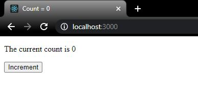
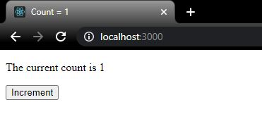

## TL;DR
Class components are ugly and hard to understand, but were needed as it was the only way to access `jsx÷state`. Hooks aleviate this, as they are functions that we can call to *hook* into `jsx÷state` and various lifecycle methods. By using hooks, we can introduce `jsx÷state` into **function** components, eliminating the need for always using class components. Instead of setting state in a `jsx÷constructor()` using `jsx÷this.state = {name: "inital"}`, we can instead call the React function `jsx÷useState` with the syntax `jsx÷const [name, setName] = React.useState("initial")`. The first value we assign is the state we want to track, the second value is a function to alter **only that** piece of state, replacing the need for `jsx÷this.setState` calls.

Since we no longer `jsx÷extend` a `jsx÷React.Component`, we use another hook to replicate the functionality of `jsx÷componentDidMount()`, `jsx÷componentDidUpdate()`, and `jsx÷componentWillUnmount()`. We do this using `jsx÷useEffect()`. The **first argument** to this is a function we want to run after the component **renders**, and the **second argument** is an **optional array**. This array is called the dependancy array, and causes the `jsx÷useEffect()` function input to only run when the component renders **and** one of the values in the dependancy array **changed** between the current render, and the previous render. Returning a function from `jsx÷useEffect()` acts as `jsx÷componentWillUnmount()`, as this function will be run when the component unmounts.

Hooks can only be called in React function components, and **never** in normal JavaScript functions or React class components. They can also only be called in the **top-level** of the function component, never inside conditions, loops, or other functions.

## What's Wrong with Classes?

In a talk at [React Conf in 2018](https://www.youtube.com/watch?v=dpw9EHDh2bM&t=1547s&ab_channel=ReactConf), the React team outlined some issues with React: in particular with `jsx÷class` components. In particular, they outline **three** things which just kinda *sucked* in React up to 2018:

1. **Wrapper hell**: Websites built with React would commonly have layers-upon-layers of nesting, leading to a pyramid of `jsx÷div`s wrapping a deeply nested component. 

![Figure 1 - An example of "wrapper hell" from twitter user GrexQL in response to Dan Abramov. [1]](./wrapper-hell.jpg)

2. **Giant components/Reusing logic**: It's not uncommon to see a lot of duplication in `jsx÷class` components. For instance, in `jsx÷componentDidMount` we may subscribe to some network requets and set some recurring events, then in `jsx÷componentWillUnmount` we simply do the opposite; a *negative mirror* of sorts. Often these two functions repeat the same code, just to the opposite effect.

```jsx
componentDidMount(){
    this.subscribeToNetwork(this.props.network);
    this.startTimers();
}
...
componentWillUnmount(){
    this.unsubscribeFromNetwork(this.props.network);
    this.stopTimers();
}
```

3. **Understanding classes**: The internal workings of `jsx÷class`es in JavaScript are just plain confusing. In particular, understanding why we need to bind `jsx÷this` in our `jsx÷constructor()` for methods we define on a `jsx÷class`. While this is a fascinating topic, it seems like a large mental barrier to overcome before we can get on with what we actually want to do: *write web applications*.

Dan Abramov, an engineer on the React team, believed that these three things were all symptoms of one issue in React: That we must use a `jsx÷class` component whenever we want to introduce `jsx÷state` - regardless of how small or simple the component is. [[2]](https://www.youtube.com/watch?v=dpw9EHDh2bM&t=1547s&ab_channel=ReactConf)

> *"React doesn't provide a stateful primative simpler than a class component"* - Dan Abramov, React Conf 2018.

**This is what Hooks aimed to fix**: they allow `jsx÷state` to exist on a *functional* component. 

## A Comparison to `jsx÷class` Components
The Hooks system is how we can use `jsx÷state` and **lifecycle** methods using only **functional components**. No `jsx÷constructor()`. No `jsx÷this`. Just plain old JS functions. Let's take `jsx÷state` for instance: how would we do this on a `jsx÷class` component?

```jsx
import React from "react";
class App extends React.Component{
    constructor(props){
        super(props);
        this.state = {data: ""};
    }

    render(){
        return <div>Here's the data: {this.state.data}</div>
    }
};
```
Well we'd need to first `jsx÷extend` from the `jsx÷React.Component` class to get access to those lifecycle methods, then we'd need to define our `jsx÷constructor()` and call `jsx÷super()`, passing in our `jsx÷props` so as not to lose access to those juicy lifecycle methods. Then, finally, we'd need to define a `jsx÷state` object using that pesky `jsx÷this` to store some piece of state we'd want to keep track of on the component.

Here's the equivalent using the hooks system:

```jsx
import React, { useState } from "react";
const App = (props) => {
    const [data, setData] = useState("");

    return <div>Here's the data: {data}</div>
};
```
Yup, **only a few lines of code**. However, there is a ***lot*** to unpack in those few lines, so let's get stuck in!

## Breaking it down
What is a Hook? Well, `jsx÷useState()` above is a *hook*. As is `jsx÷useEffect()`. As is `jsx÷useCallback()`. Sensing a theme? Hooks are pretty easy to spot as the all have the naming convention of a `use` prefix. These hooks allow us to *hook* into (hence the name) the `jsx÷state` and `jsx÷lifecycle` of a component. These hooks are defined within the `"react"` library for us.

### import React, { useState } from "react"
The first thing we must do to access these hooks is to actually import these from the "react" library. We have two ways of doing this; we can either directly `jsx÷import` the hook we want (`jsx÷useState` in this case) from the "react" library using the *object destructuring* syntax, or we can simply call `jsx÷useState` from the `jsx÷React` object we already imported. [[3]](https://developer.mozilla.org/en-US/docs/Web/JavaScript/Reference/Operators/Destructuring_assignment) For clarity, the following are exactly the same:

```jsx
// Using the React.useState syntax
import React from "react";
React.useState("Initial value");

// Using object destructuring to call useState directly
import React, { useState } from "react";
useState("Initial value")
```
> For this - and all - posts, I will tend to use the *object destructuring* syntax, however **either is fine**.

### const [data, setData]
Similar to how we used *object* destructuring above to extract a specific value from an *object*, we can use *array destructuring* to a similar effect. This time, however, it is **required**. This uses the *index* of an array to assign values. [[3]](https://developer.mozilla.org/en-US/docs/Web/JavaScript/Reference/Operators/Destructuring_assignment) For instance:

```jsx
const myArr = ["Football", "Rugby", "Badminton"];
const [bestSport, worstSport] = myArr;
bestSport; // "Football"
worstSport; // "Rugby"
```
Above we defined an array with three values in it called `jsx÷myArr`: `jsx÷"Football"` at index 0, `jsx÷"Rugby"` at index 1, and `jsx÷"Badminton"` at index 2. When we use array destructuring, the value our variables take will index-match the values in `jsx÷myArr`. Therefore, say for instance I wanted to select `jsx÷"Football"` and `jsx÷"Rugby"` from the above array.

```jsx
const myArr = ["Football", "Rugby", "Badminton"];
const [bestSport, worstSport] = myArr;
bestSport; // "Football"
worstSport; // "Rugby"
```
<small>No value judgements here!</small>

This is how the line `jsx÷const [data, setData]` is working. The `jsx÷useState` function will `jsx÷return` an array, and we are just taking the first thing in the array returned from jsx÷`useState` and assigning it to a variable *we* decided to call `jsx÷data`, and the second to a variable *we* decided to call `jsx÷setData`. The beauty of using array destructuring here is that *we* can pick the names for our variables, allowing us to choose names for the pieces of state we want (yes these variables are actually `jsx÷state`!). Although, by convention we normally use the naming scheme `jsx÷const [thing, setThing]` when defining these variables.

### const [data, setData] = useState("")
The *real* magic of the whole process happens with the call to `jsx÷useState()`. The under-the-hood workings of `jsx÷useState` use a JS concept called **closures** which we will look at when we look at *scoping* another day, however luckily we do not need to know how it works in order to make use of it (we trade a complex JS topic like `jsx÷this` for an equally complex topic called `jsx÷closures`, however in latter case we do not actually need to *know* anything about the topic to make use of it).

`jsx÷useState` returns **two** things: the value we assign to our `jsx÷data` variable, and a *function* we assign to our `jsx÷setData` variable. The **initial** value for our `jsx÷data` variable is given as an *argument* to `jsx÷useState`. [[4]](https://reactjs.org/docs/hooks-state.html) Below is a mental model for how to think about `jsx÷useState`.

```jsx
// Primative useState
function useState(initialValue){
    let value = initialValue;

    function setValue(newValue){
        value = newValue;
    }

    return [value, setValue];
}

const [myState, setMyState] = useState("Josh");

// myState is assigned to be "value",
// and setMyState is assigned to be the function "setValue"
```
For clarity - below is state introduced on a class and a function component.

```jsx
// Class component
class MyComponent extends React.Component{
    contructor(){
        super(props);
        this.state = {name: "Josh"};
    }
}

// Functional component using Hooks
const MyComponent = () => {
    const [name, setName] = useState("Josh");
}
```

Okay, but what about that second value we get back from `jsx÷useState` that we assign to `jsx÷setData`? This is a replacement for the `jsx÷this.setState()` method that we no longer have access to on a functional component. Where we would call `jsx÷this.setState()` to update **any** piece of state, with hooks we get a unique function for **each** piece of state we keep track of.

```jsx
import React, { useState } from "react";

const App = (props) => {
    const [count, setCount] = useState(0);
    const [name, setName] = useState("Josh");

    console.log(count); // 0 on the first render
    setCount(5); // console.log above now outputs 5 as this causes a re-render

    console.log(name); // "Josh"
    setName("Emily"); // "Emily" logged out above after re-render

    return(
        <div></div>
    );
};
```

We make a call to `jsx÷useState()` for each piece of state we want to keep track of, and in return we get a the piece of state as a variable (`jsx÷count`, `jsx÷name`), and a function specific to updating that *one* piece of state.

Calling `jsx÷setThing()` ( `jsx÷setCount`, `jsx÷setName` etc) also has the same effect as calling `jsx÷this.setState()` in a `jsx÷class` component: we trigger a re-render of the component. This also means we need to follow the same rule of **never mutating state directly**: we should never say `jsx÷count =` to update the value of count, only ever call `jsx÷setCount()` otherwise our component won't re-render. [[5]](https://stackoverflow.com/questions/55178507/mutating-state-from-reacts-usestate-hook) It's worth noting that everything regarding component lifecycle is **still** relevant - it's just we're now using different functions to convey the stages - we still *Mount* a functional hook component, we still *Update* a functional hook component, and we still *Unmount* at the end of the lifecycle.

> For clarity, with a `jsx÷class` component we define `jsx÷state` as `jsx÷this.state = {count: 0}` in the `jsx÷constructor` function. Then, to update our state, we call `jsx÷this.setState({count: 1})` to change our `jsx÷count` to `jsx÷1`. With a **function** component using hooks, we set each piece of state separately using the `jsx÷const [count, setCount] = useState(0)` syntax, and then update that piece of state using the `jsx÷setCount(1)` syntax to set our `jsx÷count` to `jsx÷1`.

## Common Hooks

Much like there are many lifecycle methods in `jsx÷class` components, there are also many different hooks. Luckily, much like lifecycle methods, **some are used far more often than others**.

### useState()
This is perhaps the *most* used hook in modern-day React apps. We have already explored this hook thoroughly above, and so we can say that this hook is used to create `jsx÷state` on our function components (therefore, React now has a stateful primative simpler than a `jsx÷class` component!). [[4]](https://reactjs.org/docs/hooks-state.html)

> `jsx÷useState` replaces `jsx÷this.state`, `jsx÷this.setState()`, and `jsx÷constructor()` .

### useEffect()
I mentioned that we still *Mount*, *Update*, and *Unmount* while using hooks, however by using functional component we lose access to those all important **lifecycle methods**: `jsx÷componentDidMount()`, `jsx÷componentDidUpdate()` and `jsx÷componentWillUnmount()`. This is where `jsx÷useEffect()` comes in. `jsx÷useEffect` is all **three** of the aforementioned lifecycle methods rolled into **one** function. [[6]](https://reactjs.org/docs/hooks-effect.html)

```jsx
import React, { useState, useEffect } from "react";
const App = (props) => {
    const [count, setCount] = useState(0);
    
    useEffect( () => {
        // arrow function as input for useEffect
    });

    return(
        <div>
            The count is {count}
        </div>
    );
};

```

The main part of the `jsx÷useEffect` hook is the arrow function we pass as the first argument to it. This is a function we want to run every time the component renders itself (much like `jsx÷componentDidUpdate`, except this will also run on the **initial** render too). We can also pass an optional *second* argument to `jsx÷useEffect` - this is called the **dependancy array**, which we will cover further down. This is why `jsx÷useEffect` is kind of like a mix of `jsx÷componentDidMount` (which runs on the first render) and `jsx÷componentDidUpdate` (which runs on each subsequent render). Using a `jsx÷Counter` example:

```jsx
import React, { useState, useEffect } from 'react';

const Counter = () => {
    const [count, setCount] = useState(0);

    useEffect(() => {
        document.title = `Count = ${count}`;
    });

    return (
        <div>
            <p>The current count is {count}</p>
            <button onClick={() => setCount(count + 1)}>
               Increment
            </button>
        </div>
  );
}
```
Here, we setup `jsx÷count` to be state, and then create a `jsx÷button` which will increment the count upon clicking it (`jsx÷onClick={() => setCount(count+1)}`). On the initial render, the function in our `jsx÷useEffect` hook runs and updates the *title* of our document to be the current count (`jsx÷0`).



After clicking the button to increment our count, our component will re-render and our `jsx÷useEffect` will run again, updating our title to the new value of `jsx÷count`.



I also mentioned the *dependency array*, so let's touch on that too. The dependency array is a **second (optional) argument** to `jsx÷useEffect`.

```jsx
useEffect(someFunction, []);
```
This array allows us to control more precisely *when* the `jsx÷useEffect` function runs. Perhaps we don't want to run the `jsx÷useEffect` **every** time the component re-renders; perhaps we have some specific `jsx÷useEffect` that we only want to run when a *specific* piece of state changes. For instance, using the counter from above:

```jsx
import React, { useState, useEffect } from 'react';
const Counter = () => {
    const [count, setCount] = useState(0);
    const [onlineStatus, setOnlineStatus] = useState(false);

    useEffect(() => {
        document.title = `Count = ${count}`;
    });

    return (
        <div>
            <p>The current count is {count}</p>
            <p>{onlineStatus === true ? "You're online!" : "You're NOT online!"}</p>
            <button onClick={() => setCount(count + 1)}>
               Increment
            </button>

            <button onClick={() => setOnlineStatus(!onlineStatus)}>
               Toggle online status
            </button>
        </div>
  );
}
```

Here we have two buttons - one will update our `jsx÷count`, and one that will toggle our `jsx÷onlineStatus` (a nonsense piece of state for illustration purposes). When a user toggles their online status using the appropriate button, the component will re-render to display the new `jsx÷onlineStatus` value. This triggers our `jsx÷useEffect` to run, which will update our document title to be the current value of `jsx÷count`. However, the `jsx÷count` hasn't changed since the last render, so there's no need to update the `jsx÷document.title` - running the `jsx÷useEffect` function would be a waste of processing time.

To prevent this unnecessary calling on the `jsx÷useEffect` we can specify *that particular* `jsx÷useEffect` should only be run when the `jsx÷count` changes.

```jsx
import React, { useState, useEffect } from 'react';
const Counter = () => {
    const [count, setCount] = useState(0);
    const [onlineStatus, setOnlineStatus] = useState(false);

    useEffect(() => {
        document.title = `Count = ${count}`;
    }, [count]);

    return (
        <div>
            <p>The current count is {count}</p>
            <p>{onlineStatus === true ? "You're online!" : "You're NOT online!"}</p>
            <button onClick={() => setCount(count + 1)}>
               Increment
            </button>

            <button onClick={() => setOnlineStatus(!onlineStatus)}>
               Toggle online status
            </button>
        </div>
  );
}
```
After every render, React will look at the dependency array of each `jsx÷useEffect`. It will compare the *previous* values (before the re-render) of the variables inside the array to their *current* values (after the re-render). Then, if **any** of the values have changed, React will run that `jsx÷useEffect`. If the most recent render didn't change the value of anything in the dependancy array, React will choose **not** to run that `jsx÷useEffect`. Therefore, we could have multiple pieces of `jsx÷state` in our dependency array e.g `jsx÷[a, b, c]`, and its corresponding `jsx÷useEffect` would run if `jsx÷a` **and/or** `jsx÷b` **and/or** `jsx÷c` change. Pieces of `jsx÷state` isn't all we can put into our dependency array, we can also pass in `jsx÷props` too (remember, our component re-renders upon new `jsx÷state` and/or new `jsx÷props`). One final note on the dependency array, is that we can also pass as *empty* array to it.

```jsx
import React, { useState, useEffect } from 'react';
const Counter = () => {
    const [count, setCount] = useState(0);

    useEffect(() => {
        console.log("Only on the initial render")
    }, []);

    return (
        <div>
            <p>The current count is {count}</p>
            <button onClick={() => setCount(count + 1)}>
               Increment
            </button>
        </div>
  );
}
```
This is conceptually similar to `jsx÷componentDidMount()`. Passing an empty array tells React to only run this `jsx÷useEffect` on the **first** render only, exactly the same way you'd use `jsx÷componentDidMount()`. Literally we are saying "only run this if any of the values in the dependancy array change, however the dependancy array is empty therefore no values in it can change, therefore it will only ever run on startup".

Note, we can have **multiple** calls to `jsx÷useEffect` in one component. Perhaps, taking the counter from above, we want the `jsx÷document.title` to reflect whatever the recently changed piece of state was. We could add a second `jsx÷useEffect` that would only run upon a change of `jsx÷onlineStatus`.

```jsx
import React, { useState, useEffect } from 'react';
const Counter = () => {
    const [count, setCount] = useState(0);
    const [onlineStatus, setOnlineStatus] = useState(false);

    useEffect(() => {
        document.title = "Count changed!";
    }, [count]);

        useEffect(() => {
        document.title = "onlineStatus changed!";
    }, [onlineStatus]);

    return (
        <div>
            <p>The current count is {count}</p>
            <p>{onlineStatus === true ? "You're online!" : "You're NOT online!"}</p>
            <button onClick={() => setCount(count + 1)}>
               Increment
            </button>

            <button onClick={() => setOnlineStatus(!onlineStatus)}>
               Toggle online status
            </button>
        </div>
  );
}
```

Here, we use two jsx÷`useEffect` calls with different dependancy arrays. This allows us to update the `jsx÷document.title` to reflect the most recent state change.

So, now we have `jsx÷componentDidMount` and `jsx÷componentDidUpdate` sorted, how do we use `jsx÷useEffect` to mimic `jsx÷componentDidUnmount`? Well, notice how we haven't **returned** anything from our `jsx÷useEffect` functions yet! They are all just functions that run when the component re-renders (according to their dependancy array) and have no return statement. This is because the `jsx÷return` statement acts **as** `jsx÷componentDidUnmount`. That is to say, when we `jsx÷return` a function from a `jsx÷useEffect`, the function will run when the component *unmounts*. As an example, with a class-based component if we set an interval in `jsx÷componentDidMount` we would have to clean it up again with `jsx÷componentDidUnmount`.

```jsx
import React from "react";
class App extends React.Component{

    componentDidMount(){ 
        this.interval = setInterval(() => alert("Hey I'm still here!"), 5000);
    }

    componentWillUnmount(){
        clearInterval(this.interval);
    }

    render(){
        return (
            <div>
                Hello, world!
            </div>
            );
    }
};
```

However, we could achieve the same effect using the `jsx÷useEffect` hook in a functional component!

```jsx
import React, { useEffect } from "react";
const App = () => {

    useEffect( () => {
        let interval = setInterval(() => alert("Hey I'm still here!"), 5000);

        return ( () => {
            clearInterval(interval);
        });

    }, []);

    return (
        <div>
            Hello, world!
        </div>
    );

};
```

Again, we set an interval in `jsx÷useEffect` (with an empty dependancy array so it only runs on the first render), and then we clean it up by `jsx÷return`ing a function from `jsx÷useEffect` and calling `jsx÷clearInterval` within it. This is the same as calling `jsx÷componentDidUnmount` to clear the interval.

> `jsx÷useEffect(function, [])` replaces `jsx÷componentDidMount()`, `jsx÷componentDidUpdate()`, and `jsx÷componentWillUnmount()`. 

`jsx÷useState` and `jsx÷useEffect` are by far the most common hooks. Much like the lifecycle methods, others *do* exist and have their place, however these tend to be more niche and so will not be covered here. However, hooks can pretty much be used as a direct replacement for class components and their lifecycle methods. 

## Rules
Hooks are great, however they do come with **two** caveats [[7]](https://reactjs.org/docs/hooks-rules.html):
### 1) Only use them in the **top-level of a component**

Top-level here refers to the main body of your functional component. This means Hooks **cannot** be called inside **conditions, other functions, or loops**. We cannot say "only use this hook if a condition is satisfied", or "call this hook within this loop".

```jsx
import React, { useState, useEffect } from "react";
const App = () => {

    if(/* some condition */){
        const [thing, setThing] = useState("");
        // NOT ALLOWED!
    };

    return (
        <div>
            Hello, world!
        </div>
    );

};
```

Attempting to call a hook outside of the main function body will cause an error. For clarity, I have showed explicitly where it *top level* in a given functional component, and where is not. 

```jsx
import React, { useEffect } from "react";
const App = () => {
    // Top level
    // Top level
    if(/* some condition */){
        // NOT top level
    };
    // Top level
    for (let i = 0; i < 3; i++){
        // NOT top level
    }
    // Top leve
    const someFunc = () => {
        // NOT top level
    };
    // Top level
    return (
        //NOT TOP LEVEL
        <div>
            Hello, world!
        </div>
    );
};
```
> **As a rule of thumb, if it's got parenthesis around it that aren't the main curly braces for your function component, it's probably not top level.**

For this reason, it's often good practice to declare *all* hooks right at the start of the component, before declaring any helper functions or other variables.

```jsx
import React, { useState, useEffect } from "react";
const App = () => {
    // all useState calls

    // all useEffect calls

    // Custom variables/functions

    return (
        <div>
            Hello, world!
        </div>
    );

};
```
### 2) Only call them from React Function Components
Hooks *only* exist inside a React function component - calling them inside a `jsx÷class` component or regular JS functions* will *not* work.

\* *We'll come back to that another day - calling hooks in regular JS functions aren't permitted, but we CAN call them from **Custom Hooks**, which are JS functions that use the Hook system.*

### Why?
The reasons have to do with how the Hook system works on a fundamental level. It relies on all hooks appearing in the *same* order **every** render.

```jsx
const [one, setOne] = useState("one"); // Always first, every render
const [second, setSecond] = useState("second"); // Always second, every render
const [third, setThird] = useState("Third"); // Always third, ever render
```
If we declare the hooks on the first render in this order, React expects this order to stay the same on *every* render. If, instead, we were to conditionally call a hook:

```jsx
const [one, setOne] = useState("one"); // First
if(/* condition */){
    const [second, setSecond] = useState("second"); // Sometimes second.. sometimes not called
};

const [third, setThird] = useState("Third"); // Sometimes second, sometimes third
```
This could seriously mess up the order of our hooks. Note, this applies to `jsx÷useEffect` as well; the below is also not permitted.

```jsx
const [one, setOne] = useState("one"); // First hook 
if(/* condition */){
    useEffect(() => conosle.log("something")) // Sometimes second hook.. sometimes not called
};

const [third, setThird] = useState("Third"); // Sometimes second hook, sometimes third hook
```

> **Note**: Even if the `jsx÷useEffect` function is not invoked due to the dependancy array, `jsx÷useEffect` is still technically *called* and so will still appear in the same order every time.

Therefore, if we want to include conditions or loops, we put them *inside* our hook. For example:

```jsx
if(name === "josh"){
    useEffect(() => console.log("Hi josh"));
    // NOT OKAY
};

useEffect(() => {
    if (name === "josh") {
        console.log("Hi josh");
        // Okay!
    };
});

// So long as the useEffect is called
// in the top level, we can put
// any conditions or loops inside the the useEffect
```

## Counter
To close this section on hooks, lets look back on our `jsx÷Counter` component from a previous article.

**index.js**
```jsx
import React from "react";
import ReactDOM from "react-dom";

 class Counter extends React.Component {
    constructor(props){
        super(props);
        this.state = {count : 0}
    };

    increment(){
        this.setState({count: this.state.count + 1});
    };

    decrement(){
        this.setState({count: this.state.count - 1});
    };

    render(){
        return(
            <div>
                <h1>The count is: {this.state.count}</h1>
                <button onClick={() => this.increment()}>Increment</button>
                <button onClick={() => this.decrement()}>Decrement</button>
            </div>
        );
    };
};

ReactDOM.render(
    <Counter />,
    document.querySelector("#root")
);

```

We can *refactor* (to re-write code into a different style to make it cleaner or obey different design principles) this to use hooks instead. [[8]](https://refactoring.guru/refactoring)

Firstly, we convert our `jsx÷class` into a function, and import `jsx÷useState`.

**index.js**
```jsx
import React, { useState } from "react";
// import useState
import ReactDOM from "react-dom";

 const Counter = () => { // create a function instead of a class
    constructor(props){
        super(props);
        this.state = {count : 0}
    };

    increment(){
        this.setState({count: this.state.count + 1});
    };

    decrement(){
        this.setState({count: this.state.count - 1});
    };

    render(){
        return(
            <div>
                <h1>The count is: {this.state.count}</h1>
                <button onClick={() => this.increment()}>Increment</button>
                <button onClick={() => this.decrement()}>Decrement</button>
            </div>
        );
    };
};

ReactDOM.render(
    <Counter />,
    document.querySelector("#root")
);

```
Next, instead of using a `jsx÷constructor` to create our state, let's use the `jsx÷useState` hook.

**index.js**
```jsx
import React, { useState } from "react";
import ReactDOM from "react-dom";

 const Counter = () => {
    const [count, setCount] = useState(0); // useState instead of a constructor

    increment(){
        this.setState({count: this.state.count + 1});
    };

    decrement(){
        this.setState({count: this.state.count - 1});
    };

    render(){
        return(
            <div>
                <h1>The count is: {this.state.count}</h1>
                <button onClick={() => this.increment()}>Increment</button>
                <button onClick={() => this.decrement()}>Decrement</button>
            </div>
        );
    };
};

ReactDOM.render(
    <Counter />,
    document.querySelector("#root")
);

```

Next, we can remove the `jsx÷increment` and `jsx÷decrement` methods as we can update our `jsx÷count` with `jsx÷setCount` instead.

**index.js**
```jsx
import React, { useState } from "react";
import ReactDOM from "react-dom";

 const Counter = () => {
    const [count, setCount] = useState(0);
    // removed increment/decrement methods
    render(){
        return(
            <div>
                <h1>The count is: {this.state.count}</h1>
                {/* setCount to increment/decrement */}
                <button onClick={() => setCount(count + 1))}>Increment</button>
                <button onClick={() => setCount(count - 1)}>Decrement</button>
            </div>
        );
    };
};

ReactDOM.render(
    <Counter />,
    document.querySelector("#root")
);

```
Then we can remove that render method that we don't need anymore.

**index.js**
```jsx
import React, { useState } from "react";
import ReactDOM from "react-dom";

 const Counter = () => {
    const [count, setCount] = useState(0);
    // render() removed
    return(
        <div>
            <h1>The count is: {this.state.count}</h1>
            <button onClick={() => this.increment()}>Increment</button>
            <button onClick={() => this.decrement()}>Decrement</button>
        </div>
    );
};

ReactDOM.render(
    <Counter />,
    document.querySelector("#root")
);

```
Lastly, we can clean up that `jsx÷this.state.count` to just be `jsx÷count` instead.

**index.js**
```jsx
import React, { useState } from "react";
import ReactDOM from "react-dom";

 const Counter = () => {
    const [count, setCount] = useState(0);

    return(
        <div>
            <h1>The count is: {count}</h1>
            <button onClick={() => setCount(count + 1)}>Increment</button>
            <button onClick={() => setCount(count - 1)}>Decrement</button>
        </div>
    );
};

ReactDOM.render(
    <Counter />,
    document.querySelector("#root")
);

```

There we have it! Again, this is the exact same as the `jsx÷Counter` component we made using `jsx÷class`es before, and you can copy-paste this into the `index.js` of your CRA project folder and get a cool Counter app - this time with hooks instead! Now I'm not sure about you, but I think that looks way neater and way easier to understand what's going on compared to looking at a `jsx÷constructor`, `jsx÷this` and a `jsx÷state` object.

## Summary
In summary, we have scratched the surface of the React Hook system. We saw how we can replace the lifecycle methods that we depended on `jsx÷class` components for, such as `jsx÷componentDidMount` and `jsx÷componentDidUnmount`, with the hooks system. We saw how `jsx÷useEffect` can be used to replace the three big lifecycle methods, and how we can use `jsx÷useState` to introduce the idea of `jsx÷state` into our components, allowing us to re-render a component and keep track of a changing variable throughout renders. We also briefly covered *object* and *array destructuring* and how they are used with Hooks, and covered a brief comparison of `jsx÷class` components vs functional hook components. We did **not** cover *custom hooks*, as these are less important to know compared to `jsx÷useState` and `jsx÷useEffect` and so can be left as a story for another day.

## References
1. https://twitter.com/GrexQL/status/1045110734550589441
2. https://www.youtube.com/watch?v=dpw9EHDh2bM&t=1547s&ab_channel=ReactConf
3. https://developer.mozilla.org/en-US/docs/Web/JavaScript/Reference/Operators/Destructuring_assignment
4. https://reactjs.org/docs/hooks-state.html
5. https://stackoverflow.com/questions/55178507/mutating-state-from-reacts-usestate-hook
6. https://reactjs.org/docs/hooks-effect.html
7. https://reactjs.org/docs/hooks-rules.html
8. https://refactoring.guru/refactoring