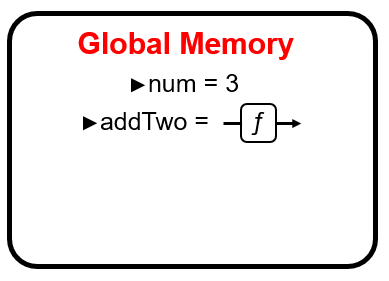
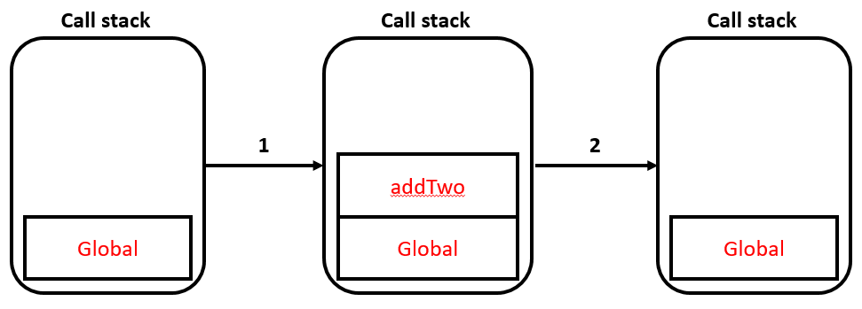

---

## Disclaimer
This is one of those **deep-dives**. Here, we will slowly step through what is actually happening when we run a piece of JS code - be it *React*, *NodeJS*, or plain old *vanilla JS*. I believe that knowing this is **essential** to understanding how JS is working; it will make it easier to **debug** your code, prevent **mistakes** from being made, and allow you to **reason** about why a piece of code works how it does. It is also essential to understanding more advanced topics, such as **promises** and **async/await**, which are paramount to what makes JS a **great language**. The following is heavily influenced by Will Sentance's [JavaScript: The New Hard Parts](https://frontendmasters.com/courses/javascript-new-hard-parts/). For a more thorough explanation, I highly recommend checking out his stuff!

This is intended to be a **four-part series**. In this section we shall explore the fundamental level of how JS code executes. In part 2, we will apply this to **closures** to explain how they fall out of this system. We shall then get our hands dirty and talk about **asynchronous JavaScript**, adding a couple important things to our mental model of how JS code runs. We shall then bring everything together for the last section, where we will talk about **iterators/generators** and use them to rebuild the **async/await functionality from scratch**.

## Execution Contexts
Primarily, JS is composed of **three** main parts (for now...):

1. A **thread of execution**: This keeps track of the current line of code we are executing.
2. **Memory**: Where we store variables defined with `jsx÷const`, `jsx÷let`, etc.
3. The **call stack**: Where we keep track of our current *execution context*.

Because Javascript is a **single threaded** language, there can only ever be **one** thread of execution (ToE). This means JS can only do *one thing at a time* (i.e. it will execute one line of code at a time - it will never execute two lines of code simultaneously). Furthermore, Javascript is a **synchronous** language, meaning *it must finish the current line of code before moving onto the next* (JS can act highly asynchronous though, which we shall see in later in the series). The combination of the thread of execution (which executes code) and some memory (which holds variables) creates an environment in which code runs. This environment is what we call an **execution context**. When we load up a JS file, we enter a new **execution context** as our ToE begins executing our code line by line, using the **global memory** to keep track of variables and their values. We call the execution context which draws on the global memory storage the **global execution context**. We shall come back to the call stack further down.

## Stepping Through Code

With that talk of execution contexts in mind, let's run through the following code very slowly and be explicit about what is happening as it runs, and what execution contexts are created/destroyed.

```javascript
const num = 3;                  // Line 1

function addTwo(input){         // Line 3
    const result = input + 2;   // Line 4
    return result;              // Line 5
};

const output = addTwo(num);     // Line 8

const newOutput = addTwo(10);   // Line 10
```

1. **Line 1**: We set aside a section in the **global memory** and call it `jsx÷num`, then place the value *3* inside it.

2. **Line 3**: We set aside a section in the **global memory** and call it `jsx÷addTwo`, then place in the *entire function definition*.



3. **Line 8**: We skip over the rest of the function as we are not executing it yet, and move on to the next line of code. Here, we set aside a section in the **global memory** and call it `jsx÷output`, and we *cannot place anything into it yet*. This is because we must first evaluate the right-hand side of our statement as we are assigning the value to be placed into *output* to be the **return value** from executing `jsx÷addTwo()` with the *argument* of `jsx÷num` (which we know to be **3**).

4. **Line 4**: We have invoked a function, and so we now begin executing the code found in the function definition. Therefore, we now have a **new execution context** (we create a new execution context every time we invoke a function). Our ToE has **left** the *global execution context* and has now entered the execution context of `jsx÷addTwo()`. As such, we have a **new memory storage**, which we shall call **local memory** (local to this execution of he function, `jsx÷addTwo`). We first set aside some space in this **local memory** and call it `jsx÷input`, and we place into local memory the value that `jsx÷addTwo` was called with; **num/3**. We then set aside room in **local memory**, call it *result*, and into it we place the evaluation of `input + 2`, which we know to be **5**.

5. **Line 5**: We hit a **return**, which ejects our ToE from the current **execution context** and goes back to wherever it was before it entered the execution context of *addTwo*. While returning, we pull out the value stored in the **local variable** called **result**, and use this as the value we assign to `jsx÷output`. After returning - **everything in that local memory is deleted, as is the execution context**. 


6. **Line 10**: Back in the global execution context, we set aside space in **global memory**, call it `jsx÷newOutput` and assign to it *nothing for now* as we need to evaluate the right-hand side first, which invokes `jsx÷addTwo` again.

7. **Line 4**: We enter a **new execution context** again (completely separate from the previous addTwo execution context as this is a separate invocation of the function), set aside space in **local memory**, call it `jsx÷input` and place into it the value we invoked `jsx÷addTwo` with - **10**. We then set aside more space in **local memory**, call it `jsx÷result` and place into it the evaluation of the right-hand side; **12**.

8. **Line 5**: We hit a return, and eject from the execution context whilst returning the value inside `jsx÷result`. We assign this value to `jsx÷newOutput`, which invoked `jsx÷addTwo` in order to get its value. By ejecting from this execution context (our ToE exits), **everything in the local memory of this execution context is once again deleted** - `jsx÷input` and `jsx÷result` now cease to exist entirely.

## The Call Stack

Now, what was the point in going over this in a stepwise fashion? Well, by stepping through this we can see at each stage what is happening with the global/local memories of each execution context, and how our thread of execution weaves in and out of these execution contexts. *We* can visually see the execution contexts, and can see how our execution thread weaves in and out, however the *computer* cannot keep track of contexts this way. This is where the **call stack** comes in to play. The call stack is responsible for keeping track of the current execution context, and which context to return to when that context ends.



The top pallet on the callstack is the current execution context, with the lower pallets indicating nested execution contexts. For instance, when we start running our code we only have one execution context; the **global** execution context. When we invoke a function, we enter a new exeuction context. Therefore, we add a pallet to the top of the callstack, and, when execution of that function ends, we *pop* that pallet off the stack and return to the context we came from. For instance, in the above, we start in **global**, then invoke **addTwo**, which adds the *addTwo* pallet to the callstack and we execute the code within it. After we hit a `jsx÷return` in `jsx÷addTwo`, we pop *addTwo* off the callstack and return to the previous context (*global*). This describes the same concept as *Figure 2* above, however this is how JS keeps track of what context we are in, what memory we have access to, and where to return to after we hit a `jsx÷return`.

To map this to the code above, we start off at **line 1** where we only have the **global** execution context on the stack, then we hit **line 8** and enter a new execution context, and so we **push** *addTwo* onto the call stack (*1* in the diagram above). After we hit a **return**, we exit the current execution context, **popping** it off the stack (*2*). Once the **global** execution context has completed (all code has finished running), our program stops as **global** is popped off the stack and our stack becomes empty.

## Summary

We went through that quite verbosely, however it's important to not skip over steps whilst we build a good mental model for how JS code executes. Now, we can visually see the different execution contexts this way, and can imagine our ToE weaving in and out of them. In summary, JavaScript is comprised of three parts: a **thread of execution**, **memory**, and a **call stack**. As we traverse through code, executing one line at a time (thread of execution), we can keep track of variables by setting aside some space in memory. When we invoke a function, we enter a new execution context and therefore add a new pallet to the call stack (push onto the call stack). After we finish executing all the code in that function, we pop the pallet off the call stack and return to the next lowest pallet, re-entering the execution context we entered from. 

**This is, fundamentally, what JS is doing all the time.** There are some additions, important additions, however at its most basic level, this is how JS code is running.
