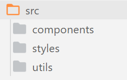
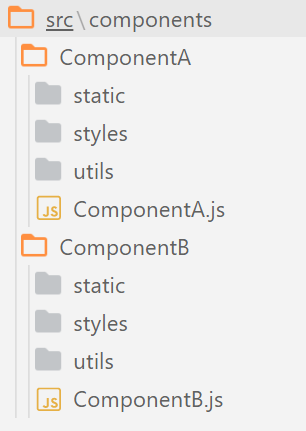

---

![Figure 1 - xkcd comic detailing how software engineers often distrust their code. [[1]]](xkcd-1.PNG)

It's a common joke that, as software engineers/developers, the code we make is buggy, inefficient, and *barely* works (as per the xkcd above). While it can be humorous in jest, **this should not be the norm**. When you hire a builder to build a house, you don't expect the walls to randomly collapse. When a mechanic fixes your car engine, you don't expect it to come back with a puncture. When you ask a food scientist how safe their new supplement is, you expect to hear about extensive testing and quality control, not *"well, we had Katie try it last week and she's still around!"*. When you hire a *professional*, you expect *professional quality*; why should software developers be different? I like what Robert Martin has to say on this:

> *"My first expectation is: **'we will not ship shit'**... When you release code, I expect it to be as high a quality as you can attain in the given time period; it should be clean, well-tested, and organised... And you know who else expects that? **Everybody** expects that, except you. If I buy a car from someone, I expect that car to work. I expect it to be well tested and put through the ringer, and I will complain bitterly if it isn't! **That** is what our customers expect from us."* **- Robert C Martin, Clean Code, Lesson 3** [[2]](https://www.youtube.com/watch?v=Qjywrq2gM8o&t=1070s)

This may come across as hyperbolic, until we take a step back and realise just *how much* society today relies on software. Here's an example of some of the consequences of buggy software:

- In 2018, [TSB experienced a software bug](https://www.independent.co.uk/news/business/news/tsb-it-failure-cost-compensation-customers-switch-current-account-a8757821.html) when transitioning their IT infrastructure.[[3]](https://www.independent.co.uk/news/business/news/tsb-it-failure-cost-compensation-customers-switch-current-account-a8757821.html) This bug caused many customers to be locked out of their accounts, or have access to other people's bank accounts. Not only did this hurt TSB (£330 million and 80,000 customers lost), it left thousands without access to pay their bills, or access to spend other people's money.

- By not testing real-life scenarios, [Heathrow airport](http://news.bbc.co.uk/1/hi/uk/7314816.stm) lost 42,000 bags and cancelled the holiday plans of everyone on 500 flights. [[4]](http://news.bbc.co.uk/1/hi/uk/7314816.stm)

- NASA [lost a space probe analysing the climate of Mars](https://www.simscale.com/blog/2017/12/nasa-mars-climate-orbiter-metric/) due to not having standardised measurements of force in their software, where one party was reporting in imperial measurements and the other in metric. This cost the scientific world years of research. [[5]](https://www.simscale.com/blog/2017/12/nasa-mars-climate-orbiter-metric/)

Point being, the software you and I write *will* impact people's lives. Maybe you won't be writing the software for large banks, however if you find yourself with that much responsibility, you'll wish you cultivated the skill of writing "good" code earlier. Note, I'm not saying everything has to be perfect. Perhaps those issues above slipped through the cracks of extremely robust procedures. We all make mistakes. But when mistakes happen and people demand answers, our excuse shouldn't be *"all code has bugs"*. We should be able to reply with a set of standards we adhere to, and have those standards evolve over time. When we ship code to production, it should be to the best of our ability; as professionals, we should take *pride* in our work.

With that in mind, let's talk about how we can begin to create code we are proud to publish!

## What Makes Code 'Good'
'Good' code is somewhat objective, and somewhat subjective. To elaborate, let me ask you: what makes food taste good? Taste is extremely subjective: while one hates sprouts, another piles their plate high with them on Christmas. However, we also have professional chefs who make their name and living by making food taste good, so there must be an element of *objectiveness* to taste. In other words, there must be a few things which will make food taste better for everyone, *regardless* of their particular tastes (for the curious, those are [salt, fat, acid, and heat](https://www.saltfatacidheat.com/buy-book) applied correctly [[6]](https://www.saltfatacidheat.com/buy-book)). As such, there will be a few things that make our code *objectively* better, and some which will depend on personal taste (*subjective*).

Dividing 'good' into objective and subjective terms allows us to focus on certain aspects of software construction, and allows us to understand why certain things are considered universal 'good practice', and why different languages may also have different interpretations on what is good. The majority of this article will discuss how to make our code *objectively* better, however some *subjective* things to keep in mind will be touched on too later.

## Objectively Good Code

When we talk about objectively good code, we tend to talk about code which has all three of the following properties: [[7]](https://www.codementor.io/learn-development/what-makes-good-software-architecture-101)

- **Functional**: It does the job you wanted it to.
- **Maintainable**: It is easy understand, easy to edit/add new features, and easy to fix things when they go wrong.
- **Robust**: It is hard to break, hard to exploit, and handles errors when they occur.

There is a lot of cross-over between these categories. Code that is easily maintainable is usually harder to break, and so is more robust. If it's easy to add and remove features from the codebase, it's probably doing the job you want it to (or, it's easier to make it do so). That being said, here's a brief overview of what is meant by each of these categories.

### Functional
> *"If you create a great website but you were asked to make a mobile app, you've provided an excellent answer to the wrong question"* - Me, About 10 minutes ago.

Functional code is about nailing down what you actually want the code to do. It's about understanding requirements, restrictions, and edge cases. Simply, **it's about providing a correct solution**. Take, for instance, the following two code snippets which both accomplish the same thing: they both call some API and return the data.

```jsx
// Snippet #1
const callAPI = async () => {
	const data = await fetch("https://jsonplaceholder.typicode.com/todos/1");
  	return data;
};

callAPI()
```

```jsx
// Snippet #2
function asyncGeneratorStep(gen, resolve, reject, _next, _throw, key, arg){
    try {
        var info = gen[key](arg); var value = info.value;
    } catch (error) {
        reject(error); return;
    }
    if (info.done) {
        resolve(value);
    } else {
        Promise.resolve(value).then(_next, _throw);
    }
}

function _asyncToGenerator(fn) {
    return function () {
        var self = this, args = arguments;
        return new Promise(function (resolve, reject) {
            var gen = fn.apply(self, args);
            function _next(value) {
                asyncGeneratorStep(gen, resolve, reject, _next, _throw, "next", value);
            }
            function _throw(err) {
                asyncGeneratorStep(gen, resolve, reject, _next, _throw, "throw", err);
            }
            _next(undefined);
        });
    };
}

var callAPI = /*#__PURE__*/function () {
  var _ref = _asyncToGenerator( /*#__PURE__*/regeneratorRuntime.mark(function _callee() {
    var data;
    return regeneratorRuntime.wrap(function _callee$(_context) {
      while (1) {
        switch (_context.prev = _context.next) {
          case 0:
            _context.next = 2;
            return fetch("https://jsonplaceholder.typicode.com/todos/1");

          case 2:
            data = _context.sent;
            return _context.abrupt("return", data);

          case 4:
          case "end":
            return _context.stop();
        }
      }
    }, _callee);
  }));

  return function callAPI() {
    return _ref.apply(this, arguments);
  };
}();

callAPI();
```

Now, I don't think its particularly controversial to prefer the first snippet. However, what if the purpose of these snippets was to call an API in a way that was compatible with all browsers? Well, suddenly the first snippet is now *awful* code for this task, as IE11 doesn't support the async/await syntax (let's ignore that Babel exists to illustrate the point, as the actual correct response here is to use the first snippet but transpile it down to ES2015 using a transpiler like Babel). [[8]](https://www.javascriptjanuary.com/blog/an-introduction-to-async-await)

The way we make our code more functional is to try and understand what is desired, and break it down into smaller steps. If you want "a successful social media platform", you have to break that down into smaller and smaller chunks until you're left with something like "users should be able to login". This is the realm of development methodologies like Scrum, which seek, in part, to understand what a customer wants and provide a correct solution. [[9]](https://www.scrumguides.org/scrum-guide.html#product-backlog)

### Maintainable

> At some point, you're going to have to fix someone else's code, or add/remove features from the existing codebase. When that day comes, you'll wish that the programmer responsible made their code cleaner.

Code is maintainable if you can come back to it 6 months later and understand how it works in a few minutes. It is also easy for other developers to pick up and work on when you're not around. This is the realm of readability, decoupling, and extensibility. For instance, let's pretend you wrote some code for a project 6 months ago which has since broken and needs fixing for a client next week. Could you work out what this does?

```jsx
function gP = async (i) => {
  const m = await u.find({"i": ${i}});
  m ? 2 : 5;
};
```
Well its asynchronous, and we seem to be looking for something in a database somewhere where `i = i`... We could probably work it out, but now we have to hunt for greater context to decipher what `js÷2` and `js÷5` mean. However, if we were to instead make this code a bit more readable we would see this:

```js
const MEMBER_PRICE = 2;
const NONMEMBER_PRICE = 5;

function getPrice = async (membershipId) => {
  const isMember = await User.find({"id": `${membershipId}`});
  if (isMember){
    return MEMBER_PRICE;
  } else {
    return NONMEMBER_PRICE;
  }
};
```
Now it's much easier to see that this is a function which returns the price to charge for some product which differs if the user is a member or not.

One way to make our code more maintainable is to make it **clean**. What is "clean code"? Well, there's [entire books written about it](https://www.goodreads.com/book/show/3735293-clean-code) if that's your jam, however personally I found it easier to watch [this 6 episode series](https://www.youtube.com/playlist?list=PLUxszVpqZTNShoypLQW9a4dEcffsoZT4k) by the very same author of the book, father of good code architecture: Robert "Uncle Bob" Martin. [[10]](https://www.goodreads.com/book/show/3735293-clean-code) [[11]](https://www.youtube.com/playlist?list=PLUxszVpqZTNShoypLQW9a4dEcffsoZT4k) Here's a list of bullet point takeaways from the book/the series, however I'd highly recommend looking over the source material yourself to get context and reasoning:

- Clean code explains itself without need for comments.
- Clean code is polite (you don't have to read all the code in a function to understand what it does).
- Functions should do one thing.
- "Good code reads like well written prose".
- Clean code is unsurprising.
- Clean code has a single source of truth, and does not duplicate itself.
- Prefer many smaller files that one larger file.
- Variable names should be proportional to its scope; the smaller the scope, the smaller the name.
- Function names should be *inversely* proportional to their scope; the smaller the scope, the more explanatory the function name should be.
- Clean code is easily testable (and has as close to 100% coverage as possible).
- Clean code doesn't rely on implementation details


### Robust

> *"But it looks fine on my screen!"* **- Every frustrated developer at some point**

Code is robust if it accounts for all possibilities, and handles errors gracefully. Robust code provides accurate information to the developer, and doesn't fall over if users interact with it in unexpected ways. [[12]](http://nob.cs.ucdavis.edu/bishop/secprog/robust.html) One way to accomplish this is to use some sort of *logger*. These provide useful error messages when things go wrong, and allow you to get a look "under-the-hood" of what's going on when users interact with your software. One example is the HTTP Request logger, [Morgan](https://github.com/expressjs/morgan), which is used in node.js applications. [[13]](https://github.com/expressjs/morgan) Following from logging errors, good error handling also helps with the robustness of code. At some point, users are going to use your software in unexpected ways and break something. When that happens, they shouldn't be faced with an eternally hanging network request, or a browser 500 error page. If your code is robust, it will steadily fall through various levels of error handling: *"Did the user attempt to access a page they don't have credentials for? Did they attempt to access a page that doesn't exist? Did something go wrong on our end?"*. The software will then provide the user with the necessary information (*"double check your username/password"*, *"Oops that page doesn't exist! Click here to return to the homepage"*, etc), without revealing possibly sensitive information (*"ERROR 500: error connecting to database mongodb://mongodb0.example.com:27017"* would reveal information about our database that the customer has no need to know). Below would be an example of a way to handle "page not found" errors using `react-router`. Without going into the details, `react-router` is a library that helps us introduce navigation between pages on a React webapp.

```jsx
import { BrowserRouter, Route } from "react-router";

import Home from "./Home";
import About from "./About";

const Navigation = () => {
  return (
      <BrowserRouter>
        <Route exact path="/" component={Home} />
        <Route path="/about" component={About} />
      </BrowserRouter>
  )
};
```
Here, we define two accessible pages on our webapp: `/`, upon which we should render the `jsx÷<Home />` component, and `/about`. upon which we should render the `jsx÷<About />` and *not* the `jsx÷<Home />` component. What happens when someone accesses a different route, for instance `/nonexistent`? Well, our app won't render anything. There is no `jsx÷<Route />` setup to handle this possibility, and so the user will be faced with a blank screen. This is a **bug** and means our code is not *robust* - it is easily broken. To fix this, we could use a `jsx÷<Switch />` component from `react-router` which, again skipping details, will render *only the first* `jsx÷<Route />` which matches a URL.

```jsx
import { BrowserRouter, Route, Switch } from "react-router";

import Home from "./Home";
import About from "./About";
import NotFound from "./NotFound";

const Navigation = () => {
  return (
      <BrowserRouter>
        <Switch>
          <Route exact path="/" component={Home} />
          <Route path="/about" component={About} />
          <Route component={NotFound} />
        </Switch>
      </BrowserRouter>
  )
};
```
With this is place, a user navigating to `/` will be faced with `jsx÷<Home />`, and one navigating to `/about` is faced with `jsx÷<About />`. When a user navigates outside of these routes, the `jsx÷<Switch />` will cause `jsx÷<NotFound />` to render instead, meaning we can create a custom Error 404 page for when a user navigates to a page not on our site. [[14]](https://reactrouter.com/web/api/Switch) This is one way of making robust navigation.

[Test-driven development](https://www.agilealliance.org/glossary/tdd/) is a development methodology which aims to create more robust software. The basic idea is to write your tests first, then write the smallest amount of code needed to make the test pass. [[15]](https://www.agilealliance.org/glossary/tdd/) While this sounds strange, it ensures that your code will always have near-100% test coverage and you can guarantee it all works. It also means that you know exactly when and how your code breaks, because at any stage the code worked a few minutes ago before you added in the most recent addition. This means you can be confident that you can make changes to your system and know if anything has broken and how to fix it.

![Figure 2 - Comic by Jeff Lofvers [16]](works-on-my-computer-donthitsave.png)

Robust code behaves the same in every environment. If your code breaks because the world progressed and a library you were using updated, then your code is *not* robust. This is known as the *"but it works on my machine"* phenomena. [[17]](https://www.kevinwanke.com/why-you-should-never-use-the-phrase-but-it-works-on-my-machine/) Nowadays, we can use tools like [Docker](https://docs.docker.com/get-started/overview/) which allow us to ensure a consistent environment for development/testing/production to reduce the amount of inconsistency across different users. [ [18]](https://docs.docker.com/get-started/overview/) Furthermore, although relating primarily to research software, [a very accessible white paper was written](https://www.ncbi.nlm.nih.gov/pmc/articles/PMC5390961/) which gives ten simple rules to create more robust software which will be used by others. [[19]](https://www.ncbi.nlm.nih.gov/pmc/articles/PMC5390961/) This is a quick read, and very easy to skim. Some of the key takeaways include: 

- Document your code and how to use it (e.g. a README file at the very least).
- Rely on established build tools and package managers (i.e. use a tool like CRA to initialise a React application if you can).
- Eliminate hard-coded paths (i.e. having `jsx÷import myImage from "C:/Users/Josh/Desktop/myImage.jpg"` will prevent others using your software). 

### Deeper Dive
I haven't even scratched the surface of the different ways you can make code more functional/maintainable/robust, however hopefully this acts as a jumping off point for you into learning more about these. What we shall move on to now are general concepts you can follow, general "rules of thumb" which will usually help your software become more functional/maintainable/robust: *software development philosophies*.

## Software Development Philosophies
There are many, *many* different philosophies when it comes to writing software. There are philosophies focusing on the large-scale development of software (such as test-driven development and agile methodologies), those focusing on general code architecture (SOLID), and those focusing on *how* we write our code (YAGNI, DRY). Each of these philosophies attempts to make code 'better' according to the three basis outlined above (functionality, maintainability, and robustness). For instance, using a test-driven development philosophy (where tests are written before code is) will ensure your code is more robust as you are thinking about testing and error handling from the very beginning. It should be noted that these development methodologies are:

1. **Language agnostic**: These principles are generalised to all programming languages, and so may be easier to implement in one language over another.
2. **Guidelines**: Don't be too dogmatic about these principles; remember, we only follow these so long as they increase the maintainability of our code by one means or another, if they become more of a hindrance then feel free to break them.

In general, these philosophies will create objectively better code. However, there is a huge caveat to add: **the degree to which each works for you will vary**. While Robert Martin advocates for following the *single responsibility principle* (see [SOLID React](solid-principles-in-react)) to the extent where each function is 4-5 lines long, Steve McConnell, author of [*Code Complete*](https://en.wikipedia.org/wiki/Code_Complete) argues it should be up to 100-200 lines. [[20]](https://en.wikipedia.org/wiki/Code_Complete) While DRYing your code is often good, attempting to apply the principle where it is not needed will lead to worse consequences that not implementing it at all. The philosophies are somewhere between *objective* and *subjective*: the ideas behind them are often objective, however people disagree on the best way to implement them in code.  With that in mind, below are a few development methodologies we can follow to increase the quality of our code.

### SOLID
I decided to extract this section to a separate article, as this article began to become unwieldly long. For a discussion on what SOLID is and how we can apply it to React, [please view my separate article here](solid-principles-in-react).

### DRY
**D**on't **R**epeat **Y**ourself is the principle that each piece of functionality should only be written the minimum number of times it is needed (usually always, *once*). [[21]](https://dzone.com/articles/is-your-code-dry-or-wet) Variables are a great example of this:

```jsx
const multiplyByNum = 2 * 3;
const addedNum = 2 + 7;
const subtractedFromNum = 2 - 1;
```

This may work, however there is a common theme among all the values: each one deals with the number `jsx÷2`. If we want to change the number to `jsx÷3`, we would have to change every instance of `jsx÷2`.

```jsx
const multiplyByNum = 3 * 3;
const addedNum = 3 + 7;
const subtractedFromNum = 3 - 1;
```
Not only is this tedious, but it is also prone to errors as it could be very easy to miss an instance of `jsx÷2` is our codebase was larger. Therefore, to save this, we create a `jsx÷num` variable. That way, if we ever want to change the number, we alter `jsx÷num` and can be assured that every instance of `jsx÷2` becomes a `jsx÷3`.

```jsx
const num = 3;
const multiplyByNum = num * 3;
const addedNum = num + 7;
const subtractedFromNum = num - 1;
```
For this reason, this principle is also referred to as the **S**ingle **S**ource **O**f **T**ruth (SSOT) principle, as we aim to extract out all commonalities into a single variable which will be used as the source of truth for the entire application. [[22]](https://en.wikipedia.org/wiki/Single_source_of_truth) This is a very useful principle to apply, as we only ever have to make changes once.

A second example could relate to functionality rather than variables. For instance, React components are a great example of this. We seek to make components modularisable such that we can customise them using props to achieve the desired functionality. Let's say we had a `jsx÷ <DeleteUserModal />` component which popped up when someone attempted to delete a user from a database:

```jsx
const DeleteUserModal = () => {
  return (
    <div>

      <p>Are you sure you wish to delete this user?</p>
      <div>
          <button>Yes</button>
          <button>No</button>
      </div>

    </div>
  )
};
```
Then, later on, you found yourself wanting another modal for when a customer is about to checkout their basket when shopping:

```jsx
const CustomerCheckoutModal = () => {
  return (
    <div>

      <p>Are you sure you want to checkout?</p>
      <div>
          <button>Checkout</button>
          <button>Edit basket</button>
      </div>

    </div>
  )
};
```

There's a lot of similarity here, so we probably don't need separate components for these two modals. Instead, we use props and make our component more abstract to DRY it:

```jsx
const ConfirmationModal = ({mainText, confirmButtonText, rejectButtonText}) => {
  return (
    <div>

      <p>{mainText}</p>
      <div>
          <button>{confirmButtonText}}</button>
          <button>{rejectButtonText}</button>
      </div>

    </div>
  )
};
```
With this, we can reuse this modal in our project in other areas.

> **DRY** is about recognising similarities between logic, and trying to abstract all that away to be as general as possible.

While this sounds perfect in theory, the reality is often not so simple. Dan Abramov has a great talk about what happens when you dogmatically stick to the DRY principle too much, and how WET code can sometimes be better (appropriately named "The WET codebase", **W**rite **E**verything **T**wice). [[23]](https://www.deconstructconf.com/2019/dan-abramov-the-wet-codebase) When we attempt to abstract out common code, we may accidently create a very poor abstraction. In the end, this ends up being worse than no abstraction at all. At this point, our code has become less maintainable by sticking to a principle too strongly. A principle is only good if it actually makes your code better (addresses functionality, makes things more maintainable, or makes it more robust). **Don't be dogmatic about any one principle.**

> *"We try so hard to avoid the spaghetti code that we create this lasagne code, where there are so many layers that you don't know what's going on anymore at all"* **- Dan Abramov, The WET Codebase** [23]


### YAGNI

![Figure 3 - xkcd demonstrating the YAGNI principle [24]](yagni-xkcd.png)

**Y**ou **A**in't **G**onna **N**eed **I**t ties in to answering the right question. Build what is required now, and build the features you may need in the future, in the future. For instance, if you're making a weather app the get the weather based on a postcode in the UK, there's no need to add support for zip codes in the USA. Sure, one day you might want to add support for this - if your codebase is maintainable (see above) it shouldn't be an expensive addition. However, trying to do this now when it won't be needed now will waste time, and have incurred a cost of building, cost of carry, and cost of delay. [[25]](https://martinfowler.com/bliki/Yagni.html) YAGNI doesn't mean "don't plan for future extensibility", it means "meet the current needs before meeting needs of the future". Facebook didn't start out with 15 million square feet of data centres, because at the time they didn't need it. [[26]](https://datacenterfrontier.com/facebooks-accelerates-data-center-expansion/)

However, there are some changes that would be **more** expensive to make down the line instead of doing them now. In general, these changes tend to be related to code architecture (what Dylan Beattie calls ["The Stuff That's Hard to Change"](https://www.youtube.com/watch?v=3LtQWxhqjqI)). [[27]](https://www.youtube.com/watch?v=3LtQWxhqjqI) When dealing with decisions such as *"what database service should I use"*, it might be worth thinking about the future even if it won't be relevant now. The UK government demonstrated this recently, where they [used Excel as a database and an old file format](https://www.bbc.co.uk/news/technology-54423988) to record coronavirus cases in 2019. [[28]](https://www.bbc.co.uk/news/technology-54423988) At the time, an excel file and a .xls format were probably fine, but this decision prevented them extending the "database" when cases grew exponentially, leading to the loss of thousands of Covid-19 results. This illustrates the dangers of over-eagerly applying the YAGNI principle to hard-to-change parts of your software. 

*An interesting note about the above example, is it demonstrates a "software development philosophy" applied to decisions around database provider and file format. These do not involve actually writing code, however the philosophies still apply. This shows how general these principles are, and how we can apply them to decisions outside of purely coding.*


### KISS
"**K**eep **I**t **S**imple, **S**tupid" states that systems should be as simple as possible, and that unnecessary complexity should be avoided. [[29]](https://en.wikipedia.org/wiki/KISS_principle) This, however, is a truism. **Obviously** we should avoid "unnecessary complexity" - it is *by definition* "unnecessary". So, how can we decide what "unnecessary complexity" is? Well - we must look back at our criteria for good software and ask some questions:

- Is this complexity required for the desired **functionality**?
- Does this complexity make the codebase easier to **maintain**?
- Is the additional complexity offset by making the codebase more **robust**?

Even if its the coolest and greatest feature in the world, it's unnecessary complexity if it doesn't answer "yes" to at least one of the above questions. For example, if we need to implement some sorting functionality to our codebase, we *could* create our own sort function... [[30]](https://www.digitalocean.com/community/tutorials/js-understanding-merge-sort)

```jsx
const merge = (arr1, arr2) => {
  let sorted = [];

  while (arr1.length && arr2.length) {
    if (arr1[0] < arr2[0]) sorted.push(arr1.shift());
    else sorted.push(arr2.shift());
  };

  return sorted.concat(arr1.slice().concat(arr2.slice()));
};

const mergeSort = arr => {
  if (arr.length <= 1) return arr;
  let mid = Math.floor(arr.length / 2),
      left = mergeSort(arr.slice(0, mid)),
      right = mergeSort(arr.slice(mid));

  return merge(left, right);
};

const sortedArr = mergeSort[3,2,5,4,1];
console.log(sortedArr) // [1, 2, 3, 4, 5]
```

However, JavaScript has a built in `jsx÷Array.sort()` method which implements a sorting algorithm for us (quicksort or merge sort depending on your runtime environemnt). [[31]](https://developer.mozilla.org/en-US/docs/Web/JavaScript/Reference/Global_Objects/Array/sort)

```jsx
// KISS - don't implement features the language does for you
const sortedArr = [3,2,5,4,1].sort((a,b) => a-b);
console.log(sortedArr) // [1, 2, 3, 4, 5]
```

KISS would mean we shouldn't create our own implementation if the built in sorting algorithm works for us. 99% of the time, someone has already solved part of the problem you're working on and there is a library or existing codepen out there. This is the beauty of open source software - all you have to do is find it. KISS, don't reinvent the wheel. Nothing sums this principle up better than Tim Peters' [*The Zen of Python*](https://www.python.org/dev/peps/pep-0020/#id2). [[32]](https://www.python.org/dev/peps/pep-0020/#id2) In particular, these two parts:

- *Simple is better than complex, complex is better than complicated.*
- *If the implementation is hard to explain, it's a bad idea. If the implementation is easy to explain, it may be a good idea.*

This distinction between *complex* and *complicated* is fairly semantic, however the implication is that a **complex** solution can be easy to explain in plain old English via a series of simple steps. A **complicated** solution, however, is hard to explain and break down into simpler steps.

Conversely, sometimes we may desire a *complex* solution over the easier solution. For instance, take the Two Sum problem. [https://leetcode.com/problems/two-sum/] We have an array of values, and we want to find a a pair of numbers in the array which sum to some value. [[33]](https://leetcode.com/problems/two-sum/)

```jsx
const sum = 52;
const array = [1, 22, 33, 15, 42, 23, 72, 51]
```

The simplest solution here is just to check each value in the array twice:

```jsx
function twoSumBad(arr, sum){
    for (let i = 0; i < arr.length; i++){
        for (let j = 0; i < arr.length; j++){
            if (arr[i] + arr[j] === sum){
                return [arr[i], arr[j]];
            }
        }
    }
    return false;
}
```

However, this involves checking every value in the array twice and so the time taken to complete this operation will increase with the **square** of our array length (see *big O notation*). A more complex, yet possibly *better* solution is to keep track of the values we have already seen using a `Set`. This means we only need to go through entire array once in totality, meaning the time taken will increase linearly instead of quadratically with array length.

```jsx
function twoSumBetter(arr, sum){

    let seenNumbers = new Set();

    for (let i = 0; i < arr.length; i++){
        const neededValue = sum - arr[i];

        if (seenNumbers.has(neededValue)){
            return [arr[i], neededValue];
        } else {
            seenNumbers.add(arr[i]);
        }
    }

    return false;
}
```
Glossing over some details here, this implementation of the two sum problem is more complex, yet runs much faster than the simple implementation. Therefore, if we are concerned primarily with speed of execution, this more complex solution is better than the simple solution. This goes to show that KISS doesn't mean *"complexity is bad"*, it just means *"don't make simple things complex if they don't need to be"*. Perhaps the best way to test if you're following the KISS principle is a form of [rubber duck debugging](https://en.wikipedia.org/wiki/Rubber_duck_debugging). [[34]](https://en.wikipedia.org/wiki/Rubber_duck_debugging) Vocalise what you're trying to do out loud, as if you're explaining how it works to someone else. If you're struggling to explain how code you wrote is working, you probably aren't following KISS; **KISS code is easily explainable**.

## Subjectively Good Code
While the above are generally accepted as 'good practice', it should be mentioned that every language/team/person is different, and so 'good practice' will vary. Therefore, below is a few things to keep in mind which will vary wherever you go, but are still important to creating good quality code. In general, these subjective measures are about making some sort of standard. It reduces cognitive burden when you don't have to worry about setting up a linter, or how to organise your files, or what to call your git branch. If there are standards in place you can follow, you will be more productive and find the whole process easier.

### Idiomatic Code
Idiomatic code means it adheres to certain practices laid out by the rest of the community. [[35]](https://medium.com/@abyu/why-writing-idiomatic-code-is-important-f7e46c799c26) For instance, idiomatic python code will make use of list comprehensions, and idiomatic JavaScript code will use `js÷let` and `js÷const` instead of `js÷var`. Idiomatic code can be important to write as it sets a standard for all code of a particular language everywhere. It doesn't matter if you work at company A or non-profit B, whether you look for help from a colleague's code or from *StackOverflow*: the JS you will see should be relatively similar in style and structure. Note, these idioms can also contradict each other in different languages. For instance, it is common to have relatively verbose variable names in Java. As such, if we wanted to create some counter variable in Java, we would write something like:

```java
int count = 0;
```
However, the idiomatic Go equivalent would be: [[36]](https://github.com/golang/go/wiki/CodeReviewComments#variable-names)

```go
c := 0
```
Obviously, this misses the context of the surrounding code which should also be used, however it illustrates some conflicting idiomatic naming conventions. Another difference is also highlighted here: **semicolons**. In some languages, like C, they are required. In others, like JavaScript, they are optional. In yet others, like Go, the compiler will strip away your semicolons should you dare use them. Is one way better than the other? No idea. But stay consistent.

### Linters
Within most languages, there will exist some sort of *linter*; for instance, ESLint is one of the linters of choice in the JavaScript/TypeScript world. [[37]](https://gomakethings.com/javascript-linters/) These are tools which scan all the code you write and attempt to catch bugs, and enforce some form of standards. You can alter these standards via configuration files, however in general they are things like *"should double quotes or single quotes be used for strings?"*, and *"should indentation be tabs or spaces?"*. There are some recommended settings you can use which will get you up and running faster, however they are by no means gospel. The reason these are highly customisable via configuration files is **because** the standards are subjective. What **isn't** subjective, however, is that you (and your team) should be consistent. Linters (and formatters such as Prettier) enforce consistency across a project, which can be incredibly useful to you and your team. I personally created a create-react-app template which comes preconfigured with the linting/prettier settings *I* like - this is available via npm and can be used to set up an initial project with CRA using `npx create-react-app <appname> --template josh-ts`.

### File structure
Note - *having* a file structure is **objectively** better than random chaos. However, the choice of exactly how you split that up is up to you; again, just keep it consistent across a project. For reference, [here's](https://react-file-structure.surge.sh/) what Dan Abramov recommends for React file structure. [[38]](https://react-file-structure.surge.sh/) Point being, this is highly subjective, so just find one that works for you.



The above showcases a relatively simple file structure, where all components are placed into a `components` directory, all stlyesheets (css, scss etc) files have their own `styles` directory, and various helper functions that have been extracted out (see SOLID principles) are placed into the `utils` folder (utilities).



Another example above shows each component now having its separate directory, with corresponding `styles`, `utils`, and `static` directories for the styling, functions, and images associated with each component, respectively.

This structure will also depend on the exact technologies you're using too. For instance, if you're using TypeScript you may want a separate `types` folder in the root of your project. Furthermore, maybe you have a monorepo containing your React frontend and your NodeJS backend.

### Paradigm
A paradigm is a way of programming, or a particular style of programming. [[39]](https://cs.lmu.edu/~ray/notes/paradigms/) Some languages, like Java and Haskell, usually favour one paradigm over another (OOP and functional, respectively). Other languages, like JavaScript, are relatively paradigm agnostic. With these languages, the degree to which you favour one paradigm over another is completely up to you. This is not an introduction to functional programming vs OOP - this is merely here to illustrate another subjective measure of 'good' code.

## Summary
We should care about the code we write, and be proud to push it into a production environment. This means we should want to make our code "good". We can think about objective measures of good (functionality, maintainability, and robustness), or subjective measures of good (a particular file structure, specific formatting, naming conventions...). **Consistency** is key when discussing subjective measures: structure your files or format your code in a way which makes sense to you, but bear in mind you must remain consistent within a project. We can follow development philosophies like DRY or SOLID to objectively increase the quality of our code in many ways, however the *degree* to which we implement each is highly subjective. Development philosophies are tools to make our code more functional, maintainable, and/or robust: when you feel they are hindering your ability to achieve those goals, put the tool down.


## References
1. https://xkcd.com/2030/
2. https://www.youtube.com/watch?v=Qjywrq2gM8o&t=1070s
3. https://www.independent.co.uk/news/business/news/tsb-it-failure-cost-compensation-customers-switch-current-account-a8757821.html
4. http://news.bbc.co.uk/1/hi/uk/7314816.stm
5. https://www.simscale.com/blog/2017/12/nasa-mars-climate-orbiter-metric/
6. https://www.saltfatacidheat.com/buy-book
7. https://www.codementor.io/learn-development/what-makes-good-software-architecture-101
8. https://www.javascriptjanuary.com/blog/an-introduction-to-async-await
9. https://www.scrumguides.org/scrum-guide.html#product-backlog
10. https://www.goodreads.com/book/show/3735293-clean-code
11. https://www.youtube.com/playlist?list=PLUxszVpqZTNShoypLQW9a4dEcffsoZT4k
12. http://nob.cs.ucdavis.edu/bishop/secprog/robust.html
13. https://github.com/expressjs/morgan
14. https://reactrouter.com/web/api/Switch
15. https://www.agilealliance.org/glossary/tdd/
16. https://donthitsave.com/comic/2016/07/15/it-works-on-my-computer
17. https://www.kevinwanke.com/why-you-should-never-use-the-phrase-but-it-works-on-my-machine/
18. https://docs.docker.com/get-started/overview/
19. https://www.ncbi.nlm.nih.gov/pmc/articles/PMC5390961/
20. https://en.wikipedia.org/wiki/Code_Complete
21. https://dzone.com/articles/is-your-code-dry-or-wet
22. https://en.wikipedia.org/wiki/Single_source_of_truth
23. https://www.deconstructconf.com/2019/dan-abramov-the-wet-codebase
24. https://xkcd.com/974/
25. https://martinfowler.com/bliki/Yagni.html
26. https://datacenterfrontier.com/facebooks-accelerates-data-center-expansion/
27. https://www.youtube.com/watch?v=3LtQWxhqjqI
28. https://www.bbc.co.uk/news/technology-54423988
29. https://en.wikipedia.org/wiki/KISS_principle
30. https://www.digitalocean.com/community/tutorials/js-understanding-merge-sort
31. https://developer.mozilla.org/en-US/docs/Web/JavaScript/Reference/Global_Objects/Array/sort
32. https://www.python.org/dev/peps/pep-0020/#id2
33. https://leetcode.com/problems/two-sum/
34. https://en.wikipedia.org/wiki/Rubber_duck_debugging
35. https://medium.com/@abyu/why-writing-idiomatic-code-is-important-f7e46c799c26
36. https://github.com/golang/go/wiki/CodeReviewComments#variable-names
37. https://gomakethings.com/javascript-linters/
38. https://react-file-structure.surge.sh/
39. https://cs.lmu.edu/~ray/notes/paradigms/