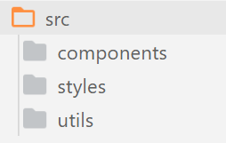
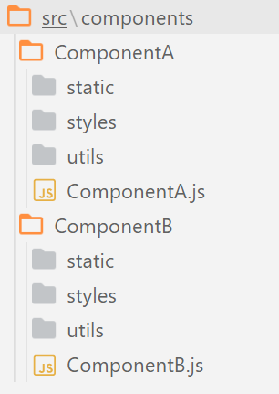

![Figure 1 - xkcd comic detailing how software engineers often distrust their code. [https://xkcd.com/2030/]](xkcd-1.PNG)

It's a common joke that, as software engineers/developers, the code we make is buggy, inefficient, and *barely* works (as per the xkcd above). While it can be humorous in jest, **this should not be the norm**. When you hire a builder to build a house, you don't expect the walls to randomly collapse. When a mechanic fixes your car engine, you don't expect it to come back with a puncture. When you ask a food scientist how safe their new supplement is, you expect to hear about extensive testing and quality control, not *"well, we had Bob try it last week and he's still around!"*. When you hire a *professional*, you expect *professional quality*. I like what Robert Martin has to say on this:

<p className="quote">"My first expectation is: <strong>'we will not ship shit'</strong>... When you release code, I expect it to be as high a quality code as you can attain in the given time period; it should be clean, well tested, and organised... And you know who else expects that? <strong>Everyone</strong>, except you. If I buy a car from someone, I expect that car to work. I expect it to be well tested and put through the ringer, and I will complain bitterly if it doesn't. That is what <i>all</i> our customers expect from us."<p className="author"> - Robert C Martin, Clean Code, Lesson 3 <a href="https://www.youtube.com/watch?v=Qjywrq2gM8o&t=1070s">[]</a></p></p>

This may come across as hyperbolic, until we take a step back and realise just *how much* society today relies on software. I'm not just talking about nulcear codes or anything like that:

- Imagine if you suddenly lost access to your bank account due to some buggy software that some poor junior developer wrote? Well you don't have to: [it happened with TSB in 2018](https://www.independent.co.uk/news/business/news/tsb-it-failure-cost-compensation-customers-switch-current-account-a8757821.html) and their reputation hasn't recovered. Not only did this hurt TSB (£330 million and 80,000 customers lost), it left thousands without access to pay their bills or, even worse, able to access *other people's bank accounts*.

- By not testing real-life scenarios, [Heathrow airport](http://news.bbc.co.uk/1/hi/uk/7314816.stm) lost 42,000 bags and cancelled the holiday plans of everyone on 500 flights. 

- NASA [lost a space probe analysing the climate of Mars](https://www.simscale.com/blog/2017/12/nasa-mars-climate-orbiter-metric/) due to not having standardised measurements of force in their software, where one party was reporting in imperial measurements and the other in metric. This cost the scientific world years of research.

Note, I'm not saying everything has to be perfect. We all make mistakes. But when mistakes happen, our excuse shouldn't be *"all code has bugs"*. We should be able to reply with a set of standards we adhere to, and have those standards evolve over time. When we ship code to production, it should be to the best of our ability; as professionals, we should take *pride* in our work.

With that in mind, let's talk about how we can begin to create code we are proud to publish!

## What Makes Code 'Good'
'Good' code is somewhat subjective, and somewhat objective. To elaborate, let me ask you: what makes someone attractive? We can make some general statements, for example facial symmetry is generally regarded as an attractive trait [https://www.sciencedirect.com/science/article/abs/pii/S1090513801000836] (objective), however it is also depends on the person (subjective). Dividing 'good' into subjective and objective terms allows us to focus on certain aspects of software construction, and allows us to understand why certain things are considered univeral 'good practice', and why different languages may also have different interpretations on what is good. Below we shall first establish what *objectively* good code is, and then we shall briefly mention some *subjective* things to keep in mind.

## Objectively Good Code

'Good' software is incredibly hard to define, and can be incredibly subjective. However, we can point to some objective traits that make some code better than others. In general, however, good software is:

- **Funcional**: It does the job you wanted it to.
- **Maintainable**: It is easy understand, easy to edit/add new features, and easy to fix things when they go wrong.
- **Robust**: It is hard to break, hard to exploit, and handles errors when they occur.


### Funcional
<p className="info">Write code to complete project requirements.</p>

This part of good software deals with requirements, and where methodologies "agile development" make their home. Every decision we make should have some reason as to how it makes steps towards some overarching goal. If you create the greatest JavaScript framework in the world but you were asked to create a twitter clone, then you've provided an excellent answer to the wrong question. This is the realm of usability, and agile frameworks.

Code that is functional provides a correct answer to a given question. Take, for instance, the following two code snippets which both accomplish the same thing.

```jsx
const callAPI = async () => {
	const data = await fetch("https://jsonplaceholder.typicode.com/todos/1");
  	return data;
};

callAPI()
```

```jsx
function asyncGeneratorStep(gen, resolve, reject, _next, _throw, key, arg){
    try {
        var info = gen[key](arg); var value = info.value;
    } catch (error) {
        reject(error); return;
    }
    if (info.done) {
        resolve(value);
    } else {
        Promise.resolve(value).then(_next, _throw);
    }
}

function _asyncToGenerator(fn) {
    return function () {
        var self = this, args = arguments;
        return new Promise(function (resolve, reject) {
            var gen = fn.apply(self, args);
            function _next(value) {
                asyncGeneratorStep(gen, resolve, reject, _next, _throw, "next", value);
            }
            function _throw(err) {
                asyncGeneratorStep(gen, resolve, reject, _next, _throw, "throw", err);
            }
            _next(undefined);
        });
    };
}

var callAPI = /*#__PURE__*/function () {
  var _ref = _asyncToGenerator( /*#__PURE__*/regeneratorRuntime.mark(function _callee() {
    var data;
    return regeneratorRuntime.wrap(function _callee$(_context) {
      while (1) {
        switch (_context.prev = _context.next) {
          case 0:
            _context.next = 2;
            return fetch("https://jsonplaceholder.typicode.com/todos/1");

          case 2:
            data = _context.sent;
            return _context.abrupt("return", data);

          case 4:
          case "end":
            return _context.stop();
        }
      }
    }, _callee);
  }));

  return function callAPI() {
    return _ref.apply(this, arguments);
  };
}();

callAPI();
```

Now, I don't think its particularly controversial to prefer the first snippet. However, what if the purpose of these snippets was to call an API in a way that was compatible with all browsers? Well, suddenly the first snippet is now *awful* code for this task, as IE11 doesn't support the async/await syntax (let's ignore that Babel exists to illustrate the point here, as the actual correct response here is to use the first snippet but transpile it down to ES2015). [https://www.javascriptjanuary.com/blog/an-introduction-to-async-await] This goes to show that good code is code which provides the functionality expected of it. This is why methodologies like Scrum exist, as they try and really break down what 'desired' functionality is into actionable steps.

### Maintainable
Code is maintainable if you can come back to it 6 months later and understand how it works in a few minutes. It is also easy for other developers to pick up and work on when you're not around. This is the realm of readability, decoupling, and extensibility. For instance, let's pretend you wrote some code for a project 6 months ago which has since broken and needs fixing for a client next week. Could you work out what this does?

```jsx
function gP = async (i) => {
  const m = await u.find({"i": ${i}});
  m ? 2 : 5;
};
```
Well its asynchronous, and we seem to be looking for something in a database somewhere where `i = i`... We could probably work it out, but now we have to hunt for greater context or try and decipher what "2" and "5" mean. However, if we were to instead make this code a bit more readable we would see this:

```js
const MEMBER_PRICE = 2;
const NONMEMBER_PRICE = 5;

function getPrice = async (membershipId) => {
  const isMember = await User.find({"membershipId": `${membershipId}`});
  if (isMember){
    return MEMBER_PRICE;
  } else {
    return NONMEMBER_PRICE;
  }
};
```
Now it's much easier to see that this is a function which returns the price to charge for some product which differs if the user is a member or not.

### Robust
Code is robust if it accounts for all possibilities, and handles errors gracefully. This is the realm of testing and error handling.


## Software Development Philosophies
There are many, *many* different philosophies when it comes to writting software. There are philosophies focusing on the large-scale development of software (such as test-driven development and agile methodologies), and those focusing on very language-specific features (idiomatic code). Each of these philosophies attempts to make code 'better' according to the three basis outlined above (functionality, maintainability, and robustness). For instance, using a test-driven development philosphy (where tests are written before code is) will ensure your code is more robust as you are thinking about testing and error handling from the very begining. For the most part, we will touch on philisophies and principles which seek to make code more maintainable, as this is what we generally think of when we think of good software in isolation. Functionality must be compared against user requirements, and robustness must be compared against tests. It should be noted, however, that these principles are:

1. Language aganostic: These principles are generalised to all programming languages, and so may be easier to implement in one language over another.
2. Guidelines: Don't be too dogmatic about these principles; remember, we only follow these so long as they increase the maintainability of our code by one means or another, if they become more of a hinderence then feel free to break them.

### SOLID
I decided to extract this section to a separate article, as this article began to become unwieldly long. For a discussion on what SOLID is and how we can apply it to React, <a href="solid-principles-in-react">please view my separate article here</a>.

### DRY
**D**on't **R**epeat **Y**ourself is the principle that each piece of functionality should only be written the minimum number of times it is needed. Variables are a great example of this:

```jsx
const multiplyByNum = 2 * 3;
const addedNum = 2 + 7;
const subtractedFromNum = 2 - 1;
```

This may work, however there is a common theme among all the values: each one deals with the number `jsx÷2`. If we want to change the number to `jsx÷3`, we would have to change every instance of `jsx÷2`.

```jsx
const multiplyByNum = 3 * 3;
const addedNum = 3 + 7;
const subtractedFromNum = 3 - 1;
```
Not only is this tedious, but it is also prone to errors as it could be very easy to miss an instance of `jsx÷2` is our codebase was larger. Therefore, to save this, we create a `jsx÷num` variable. That way, if we ever want to change the number, we alter `jsx÷num` and can be assured that every instance of `jsx÷2` becomes a `jsx÷3`.

```jsx
const NUM = 3;
const multiplyByNum = NUM * 3;
const addedNum = NUM + 7;
const subtractedFromNum = NUM - 1;
```
For this reason, this principle is also refered to as the **S**ingle **S**ource **O**f **T**ruth (SSOT) principle, as we aim to extract out all commonalities into a single variable which will be used as the source of truth for the entire application.

#### Overdoing it
While this sounds perfect in theory, the reality is often not so simple. Dan Abramov has a great talk about what happens when you dogmatically stick to the DRY principle too much (appropriately named "The WET codebase", **W**rite **E**verything **T**wice) [https://www.deconstructconf.com/2019/dan-abramov-the-wet-codebase]. When we attempt to abstract out common code, we may accidently create a very poor abstraction. In the end, this ends up being worse than no abstraction at all. At this point, our code has become less maintainable by sticking to a principle too strongly. A principle is only good if it actually makes your code better (addresses functionality, makes things more maintainable, or makes it more robust). Don't be dogmatic about any one principle.

> "We try so hard to avoid the spaghetti code that we create this lasagna code, where there are so many layers that you don't know what's going on anymore at all" - Dan Abramov


### YAGNI
https://xkcd.com/974/

**Y**ou **A**in't **G**onna **N**eed **I**t ties in to answering the right question. Build what is required now, and build the features you may need in the future, in the future. For instance, if you're making a weather app the get the weather based on postcode in the UK, there's no need to add support for zipcodes in USA. Sure, one day you might want to add support for this - if your codebase is maintainable (see below) it shouldn't be an expensive addition. However, trying to do this now when it won't be needed now will waste time, and have incurred cost of building, cost of carry, and cost of delay [https://martinfowler.com/bliki/Yagni.html]. 

YAGNI doesn't mean "don't plan for future extensibility", it means "meet the current needs before meeting needs of the future". Facebook didn't start out with x million servers and data warehouses, because at the time YAGNI. However, once they did once they needed it.

#### Overdoing it
There are some changes that would be expensive to make down the line. If you know if 6 months time you'll need to be able to support 1 million users but right now you only need to support 100,000, maybe you should chosse a database which has the capability of more than 200,000. Migrating 200,000 users to another database in 6 months time would be way harder than just taking the initial time hit to set up the larger database now in preperatino for the future. [https://martinfowler.com/bliki/Yagni.html]


### KISS
**K**eep **I**t **S**imple, **S**tupid states that systems should be as simple as possible, and that unecessary complexity should be avoided. This, however, is a truism. **Obviously** we should avoid "unecessary complexity" - it is *by definition* "unnecessary". So, how can we decide what "unecessary complexity" is? Well - we must look back at our criteria for good software:

- Does this change create the desired **functionality**?
- Does this change make the codebase easier to **maintain**?
- Does this style of coding make the system more **robust**?

Even if its the coolest and greatest feature in the world, it's unecessary complexity if it doesn't answer "yes" to at least one of the above questions. For example, if we need to implement some sorting functionality to our codebase, we *could* create our own sort function...[https://www.digitalocean.com/community/tutorials/js-understanding-merge-sort]

```jsx
const merge = (arr1, arr2) => {
  let sorted = [];

  while (arr1.length && arr2.length) {
    if (arr1[0] < arr2[0]) sorted.push(arr1.shift());
    else sorted.push(arr2.shift());
  };

  return sorted.concat(arr1.slice().concat(arr2.slice()));
};

const mergeSort = arr => {
  if (arr.length <= 1) return arr;
  let mid = Math.floor(arr.length / 2),
      left = mergeSort(arr.slice(0, mid)),
      right = mergeSort(arr.slice(mid));

  return merge(left, right);
};

const sortedArr = mergeSort[3,2,5,4,1];
console.log(sortedArr) // [1, 2, 3, 4, 5]
```

However, JavaScript has a built in `jsx÷Array.sort()` method which implements a sorting algo for us (quicksort or merge sort depending on your runtime environemnt).

```jsx
const sortedArr = [3,2,5,4,1].sort((a,b) => a-b);
console.log(sortedArr) // [1, 2, 3, 4, 5]
```

99% of the time, someone has already solved part of the problem you're working on and there is a library or existing codepen out there. This is the beauty of open source software - all you have to do is find it. KISS, don't reinvent the wheel.

#### Overdoing it
Sometimes, the simplest solution *isn't* the best. Sometimes, that codepen/library doesn't quite have the functionality you need from it. At this point, it's appropriate to add in some additional complexity. For instance, take the Two Sum problem. We have an array of values, and we want to find a a pair of numbers in the array which sum to some value.

```jsx
const sum = 52;
const array = [1, 22, 33, 15, 42, 23, 72, 51]
```

The simplest solution here is just to check each value in the array twice:

```jsx
function twoSumBad(arr, sum){
    for (let i = 0; i < arr.length; i++){
        for (let j = 0; i < arr.length; j++){
            if (arr[i] + arr[j] === sum){
                return [arr[i], arr[j]];
            }
        }
    }
    return false;
}
```

However, this involves checking every value in the array twice and so the time taken to complete this operation will increase with the square of our array length (see big O notation). A more complex, yet *better* solution is to keep track of the values we have already seen, therefore we only need to go through the array n times instead of n^2 times.

```jsx
function twoSumBetter(arr, sum){

    let seenNumbers = new Set();

    for (let i = 0; i < arr.length; i++){
        const neededValue = sum - arr[i];

        if (seenNumbers.has(neededValue)){
            return [arr[i], neededValue];
        } else {
            seenNumbers.add(arr[i]);
        }
    }

    return false;
}
```
Glossing over some details here, this implementation of the two sum problem is more complex, yet runs much faster than the simple implementation. It is up to your experience as a developer, and the experience of those around you, to know when complexity is needed or when complexity is necessary.


## Subjectively Good Code
This article will mainly deal with what is considered objectively good code; coding standards which are almost universally applicable. However, it should be mentioned that every language/team/person is different, and so 'good practice' will vary. Therefore, below is a few things to keep in mind which will vary wherever you go, but are still important to creating good quality code. In general, these subjective measures are about making some sort of standard. It reduces cognitive burden when you don't have to worry about setting up a linter, or how to organise your files, or what to call your git branch. If there are standards in place you can follow, you will be more productive and find the whol process easier.

### Idiomatic Code
Idiomatic code means it adheres to certain practices laid out by the rest of the community. For instance, idiomatic python code will make use of list comprhensions, and idiomatic JavaScript code will use `js÷let` and `js÷const` instead of `js÷var`. Idiomatic code can be important to write as it sets a standard for all code of a particular language everywhere. It doesn't matter if you work at company A or nonprofit B, whether you look for help from a colleagues code or from stackoverflow: the JS you will see should be relatively similar in style and stucture. Note, these idioms can also contradict each other in different languages. For instance, it is common to have relatively verbose variable names in Java. As such, if we wanted to create some counter variable in Java, we would write something like:

```java
int count = 0;
```
However, the idiomatic Go equivalent would be: [https://github.com/golang/go/wiki/CodeReviewComments#variable-names]

```go
c := 0
```
Obviously, this misses the context of the surrounding code which should also be used, however it illustrates some conflicting idiomatic naming conventions. Another difference is also highlighted here: **semicolons**. In some languages, like C, they are required. In others, like JavaScript, they are optional. In yet others, like Go, the compiler will strip away your semicolons should you dare use them.

### Linters
Within most lanugages, there will exist some sort of *linter*; for instance, ESLint is one of the linters of choice in the JavaScript/TypeScript world. [https://gomakethings.com/javascript-linters/] These are tools which scan all the code you write and attempt to catch bugs, and enforce some form of standards. You can alter these standards via configuration files, however in general they are things like *"should double quotes or single quotes be used for strings?"*, and "*should intentation be tabs or spaces?*". There are some recommended settings you can use which will get you up and running faster, however they are by no means gospel. The reason these are highly customisable via configuration files is **because** the standards are subjective. What **isn't** subjective, however, is that you (and your team) should be consistent. Linters (and formatters such as Prettier) enforce consistency across a project, which can be incredibly useful to you and your team. I personally created a create-react-app template which comes preconfigured with the linting/prettier settings *I* like - this is available via npm and can be used to set up an inital project with CRA using `npx create-react-app <appname> --template josh-ts`.

### File structure
Note - *having* a file structure is **objectively** better than random chaos. However, the choice of exactly how you split that up is up to you; again, just keep it consistent across a project. For refernce, [here's](https://react-file-structure.surge.sh/) what Dan Abramov recommends for React file structure. Point being, this is highly subjective, so just find one that works for you.



The above showcases a relatively simple file structure, where all components are placed into a `components` directory, all stlyesheets (css, scss etc) files have their own `styles` directory, and various helper functions that have been extracted out (see SOLID principles) are placed into the `utils` folder (utilities).



Another example above shows each component now having its separate directory, with corrosponding `styles`, `utils`, and `static` directories for the styling, functions, and images associated with each component, respectively.

This structure will also depend on the exact technologies you're using too. For instance, if you're using TypeScript you may want a separate `types` folder in the root of your project. Furthermore, maybe you have a monorepo containing your React frontend and your NodeJS backend.

### Paradigm
A paradigm is a way of programming, or a particular style of programming. [https://cs.lmu.edu/~ray/notes/paradigms/] Some languages, like Java and Haskell, usually favour a paradigm (OOP and functional, respectively). Other languages, like JavaScript, are relatively paradigm agnostic. With these languages, the degree to which you favour one paradigm over another is completely up to you. This is not an introduction to functional programming vs OOP - this is merely here to illustrate another subjective measure of 'good' code.

### Others
The list could go on and on: semi colons or not, how many spaces to indent, React vs Angular (vs Svelete vs Vue vs a million other frameworks)... For this reason, I advise you to find some subjective measures you like and fit within your current projects/teams. Focus more on the *objective* improvements you can make to your code, rather than sweating over if you should intent 2 spaces instead of 4.