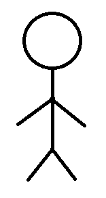

![Figure 1 - A modern day computer. [https://unsplash.com/photos/1SAnrIxw5OY]](kari-shea-computer-unsplash.jpg)

## Disclaimer
Have you ever wondered *how a computer works*? Seriosuly, modern day life wouldn't carry on without them, however even seasoned programmers can be unfamiliar with the foundational level. Now, I'm no electrical engineer (I'm just a Chemistry grad), and I found myself in this situation: I could create an e-commerce website with a functioning backend and payment system, however I couldn't really explain what was going on internally. Therefore, this article is for all those out there who wonder about how passing electricity into a rock allows us to see cats on Reddit, or make a living writing instructions for a computer.

We're not really gonna talk about *JavaScript*, we're not gonna talk about frameworks, or *React*, or anything like that. We're going straight from the ground up; from **binary** to **`print "Hello, World!`**. And that's where we will stop! Furthermore, I have sprinkled in a few smaller sized paragraphs indicated with an asterix; these can be skipped over, and exist only to elaborate a little on some of the simplifications performed for the curious. So, with that disclaimer out of the way, let's begin!

## 1's and 0's

### Transistors
Computers run on electricity, and inside the computer are **billions** of tiny gates that can either be *open* or *closed*. [https://whatis.techtarget.com/definition/transistor] When they are open, electricity can flow through them. When they are closed, electricity cannot. These are called *transistors*. These come in many flavours, however the purpose of them is the same: they either let electricity through, or they don't.

![Figure 2 - A type of transistor called a MOSFET, approx. 35 nm in size. [https://www.tutorialspoint.com/basic_electronics/basic_electronics_mosfet.htm]](mosfet.png)

Instead of open or closed, we can say that a transistor can either be **on**, when the gate is open, or **off**, when the gate is closed. These are the only two states that can exist - each one of these billion transistors are either on or off, allowing electricity to flow through them or not, respectively. There's a name for when some system is composed of two states: *binary*. [https://www.merriam-webster.com/dictionary/binary] You might've heard the term binary when talking about computers. Binary - literally meaning *made of two things* - refers to the most foundational level of how computers store and process information. [https://www.bbc.co.uk/bitesize/guides/zwsbwmn/revision/1] Instead of transsitors being on or off, we can instead say `1` or `0` - `1` being the gate is open, `0` being it is closed. We call this `1` or `0` a **b**inary dig**it**, or a *bit* for short. This bit represents the smallest amount of information a computer can hold - you can't get a much more basic piece of information than *"There's either electricity flowing, or there isn't"*! [https://www.techopedia.com/definition/2678/binary-digit-bit]

## HERE
If that's a little abstract, think of it this way. Let's say we have a long tube which is open at one end, and splits off into 4 separate tubes at the other end.

We can pour water down the top of this tube, and, as we expect, it will flow through each of the 4 channels at the bottom and then exit to where ever it may lead. This is exactly like a shower head works; water comes in from the main hose and is then forced through the holes in the head and out into the shower.

Now, let's say we put up a little shutter over each of the 4 bottom channels, which we can either *open* to let the water flow through, or *close* to stop the water from flowing out. (*Let's ignore the physics here that would cause the water to start to pile up on the closed shutter, potentially causing a backflow - in this example the water just stops*).


Here, the red marks across the two middle channels indicate we have closed off those channels, while the two outer channels remain open. Well, it's not then much of a stretch to then attach an annotation to our diagram showing which channels are open and which are closed by adding a `1` or a `0`.


So we have channel **A** is a **1**, channel **B** is a **0**, channel **C** is a **0** and channel **D** is a **1**. Well, this is exactly how electricity is working in your computer. The water represents electricity, the top represents the electricity coming from your power supply (a battery, wall socket etc), and the red marks marks represent those gates that let electricity through or not. These gates are called *transistors*.

Now, your computer has **billions** of these structures, all interlinked with each other. The electricity from each of these channels above will flow into another one of these structures, which will again split into multiple channels each with their own gates (transistors) to let electricity through or not. This gets *extremely* complicated very quickly - when we have *one* of these structures, we have **4** `bits` of information. Now let's say we connect each one of those channels to another one of these structures. Now each one of these channels splits into 4 separate channels, and we have `4x4 = 16` of these gates (transistors), so `16` `bits` of information. Now, we do it again and we have `4x16 = 64` `bits`. Then  `256`. Then `1024`. You get the point. Now imagine you have **billions** of these, and that's the level of complexity which this simple concept expands in to when we talk about modern-day computing.

 This shows how we get **`1`'s** and **`0`'s**; `bits` of information. This is the foundation for *everything* that happens on a computer: from watching YouTube to performing complex simulations, it's all just `1`'s and `0`'s.

 <p style="font-size: 15px">* - I neglected to mention this as to not get bogged down with the details, but the structure I gave above showing the 4 channels, each with their own transistor, is in actuality much more complicated. In reality, electricity flows into things called logic gates which contain the transistors, and depending on the mix of signals coming in the logic gates will output some signal. [http://hyperphysics.phy-astr.gsu.edu/hbase/Electronic/trangate.html] However, this starts to get into the realm of electronic circuits which is way beyond the scope anything I will write.</p>

## Abstractions

### What is an abstraction?
Now when we use computer, we obviously don't just see a stream of billions of `1`'s and `0`'s. This is because there are many layers of *abstraction* between the foundational binary units of information, and the text on your screen. An *abstraction* is where we take something complicated and filter it out to focus on the parts we care about. It's about making and recognizing patterns to help us make sense of things, or to represent complex things in simple ways. For instance, a **stick figure** is a great example of an abstraction.



In reality, a person is made of many cells, each with their own incredibly complex machinery. People usually have a nose, a mouth, ears, eyes of a specific color... you get the point. But if someone showed you a stick figure, you could recognize that as a **representation** of a person because it's got the **basic outline** of we could recognize as person: a head, two arms, two legs, and a body. Sure, not everyone has two arms or two legs, but we can recognize a stick figure for what it is: an *abstraction* used to convey the idea of a person in a very simple way. In a game of *Pictionary*, we don't spend painstaking years drawing the perfect drawing of a human being, making sure to draw every detail and every pore - we abstract away from that as everyone will get what you mean if you just draw a few lines and a circle. Similar to this, as users of a computer, we don't want to deal with billions of bits. As such, we abstract!

### Bytes
One large abstraction we perform, is to group those `1`'s and `0`'s into groups of eight, and call this grouping one **byte** of information. For example `10101010` is one **byte**, as is `00000000` and `11011100`. Why eight you may ask? Because historically it took **eight** `bits` of information to display a **single** letter (also called a single *character*). [https://en.wikipedia.org/wiki/Byte] The letter `a` takes 8 bits of information to be conveyed. In fact, we can write `a` in binary: it's `01100001`. `B` in binary is `01000010`. Why is `01100001` the letter `a`? In short, because someone somewhere said it should be, and that's as much as we need to know. This usage of the letter `a` to represent `01100001` is another abstraction we make. Again, we don't draw every detail, we draw a stick figure - the computer knows what we mean when we say `a` instead of `01100001`.

 <p style="font-size: 12px">* - There are actually many ways of deciding what "a" should be. The ways in which this is decided is called the "encoding" of the binary data - here I have used the "American Standard Code for Information Interchange", or ASCII, encoding method. [https://en.wikipedia.org/wiki/ASCII] Using the ASCII method, "a" can be represented in a single byte of information, 01100001. The downfall of this rather simple approach is it is not capable of handling non-english characters. Many characters, such as those with accents (é, ã, ç, etc) or those part of a different alphabet entirely (such as the Russian cyrillic alphabet, or Mandarin characters) cannot be encoding using ASCII - they cannot be represented in a single byte. This is where other encoding standards like UTF-8 came along, which use more bytes to store letters and store them as different binary values, however can include non-english alphabet letters. [https://www.asc.ohio-state.edu/demarneffe.1/LING5050/material/characters.html]</p>

### Building up from Bytes
So we have bytes, which give us enough freedom to represent a single character of text (`a`, `z`, `F` etc...). But, often times, we want to do a bit more than that. We want to write *strings* of characters to form a sentence (`Hello there`). We want to be able to represent `numbers` to do maths with computers. We want to represent sounds, and images, and videos. The way in which this happens is complicated, however it's all `bytes` of information. We need 1 byte to represent a number from 0-255. We need 2 bytes to start representing *negative* numbers. At the end of the day, its all just different `bits` of information stored into `bytes` on our computer, which will exist as long as that electricity is flowing a specific way through your computer (as long as those transistors remain in their open/closed state)... but what about when we turn the electricity off? We'll tackle that in the next section!

## Hardware
Hardware consists of physical things on the computer that we could physically touch (although, we *might not want to*). The hardware of a computer gives us access to data storage and is what uses those transistors we mentioned at the start. Those transistors are physical things which are placed onto bits of computer hardware and are all connected together to form a computer. Below I#ll briefly explain **three** important pieces of computer hardware: **Memory**, **Storage** and the **CPU**.

### Memory


There's an entire section of your computer which has a huge array of these transistors, all dedicated to having electricity flow through them in a particular way to temporarily store different information. This is called the computer **memory**. When you open a post on Facebook, that text is being temporarily stored in your computer by keeping electricity flowing through. When you open a different post, the particular electricity flow that was showing you the previous post will change as it is no longer needed, and your computer will make electricity flow through its memory in a way as to display the new message. [https://www.avast.com/c-what-is-ram-memory]

For instance, let's say you had a very boring friend who, whenever you left your laptop unlocked, would go into NotePad and type a *single letter*. When you arrive back to your desk and see the letter `a` in NotePad. Under-the-hood in your computer memory, electricity is flowing in such a way that the individual transistors (each representing a `1` or `0`) forms the `byte` of information `01100001`. The next day, he's written `G`. Again, in your computer memory is currently electricity flowing through specific gates to form `01000111`, which is the binary representation of `G`. Now this is *grossly oversimplified*, however it's a useful mental model to imagine.

Now let's say you actually really like this friend and find their little single-letter notes cute. You want to save them to your computer, so you can look back at all the fond memories. However, we've got a problem: remember I said that when `a` is on screen its because electricity if flowing to form a `byte` representing `a`? Well when you turn *off* your computer, the electricity stops flowing. All that data gets erased. This is what happens when you get a power-cut midway through writing a word document, and lose all your progress. [https://phys.org/news/2012-08-memory-leaks.html] Therefore, to prevent this, we *save* the notepad file or the word document to our computer. We take that temporary *memory* and instead convert it to *storage*.

<p style="font-size: 12px">* - Computer "memory" is often called <b>Random Access Memory (RAM)</b>, however to avoid introducing too much jargon we shall keep calling it <i>memory</i> rather than RAM.</p>

### Storage
![Figure x - A hard drive containing the storage for a computer. [https://en.wikipedia.org/wiki/Hard_disk_drive#/media/File:Laptop-hard-drive-exposed.jpg]](hdd.jpg)

**Quick note:** Yes, it is very confusing having *temporary storage* being called *memory*, and long-term storage being called *storage*, however I'll try to make it clear. When we talk about *memory* we are talking about some data (`bits` from those transistors) which only exists whilst electricity is flowing through the computer. The key difference between *memory* and *storage* is that *memory* disappears once the power goes off, *storage* does not.

Well, how do we store a snapshot of how the electricity was flowing through those transistors to display `a` or `G` in our NotePad file? Well in short, **magnets**. You probably know the gist of magnets, despite how they *actually* work being incredibly complex. Take a bunch of pieces of iron in a box - they aren't stuck to each other. However, you can take a magnet, hold it close to a piece of iron (e.g - a nail), and that piece of iron will now be *magnetized*. [https://sciencing.com/magnetize-demagnetize-metal-8498102.html] It'll stick to one end of the magnet. Now, if you take that same nail, you could hold it close to a paperclip and it'd pick up the paper clip. You've turned the iron nail into a magnet (temporarily, at least). Now we can do something clever - we have a nail that can either be *magnetized* or *not*, and we can test this by holding it close to a paperclip. **This is starting to sound an awful lot like that `1`'s and `0`'s talk above!**

In fact, its *exactly* like that. That iron nail, which can be magnetized or not, represents a `bit` of information (a `1` or a `0`). Now imagine that, somewhere in your computer there is a physical disk with **billions** of these nails on them (this disk is called the *hard drive disk*, or *HDD*). As some quick maths, let's say your computer or phone has **20 GB** of storage, well 20 gigabytes is 20,000 megabytes. 1 megabyte is 1,000,000 bytes of information, with each byte being 8 bits. From this we can work out that 20GB of storage is a physical disk (like a small CD inside your computer), which can hold *20,000,000,000 bytes* of information, or *160,000,000,000 bits* of information. This means that `20 GB` of storage is like a CD inside your computer which can hold 160 billion of those iron nails we talked about, which can be magnetized or not. This is how to get our `1`'s and `0`'s. [https://www.explainthatstuff.com/harddrive.html]

So, when we save a word document or a notepad file, we are taking the current bits of information stored in the computer memory, and copying them over to the storage. This means that when we save that notepad file from our dear friend which says `a`, we are going to the *hard disk drive*, opening it up, taking `8` of those iron nails in there and magnetized them in the order `01100001`. Or in more verbose terms, we find `8` nails in a row that aren't currently being used, we leave the first one alone, we magnetize the next two, then we leave the next four alone, then we magnetize the last one. Then we put a little box around those `8` nails so our computer knows that they're in use, and not to change their magnetization status. This means that, whenever we want to re-open that notepad file, we just have to go into our computer's storage and tell it *"Hey I want to open this now; copy the `bits` represented by these particular iron nails over to memory so I can look at them again"*.

You might rightly ask "Well what's the point in computer memory, why can't I just directly use the hard drive for everything?". It's because this process of going to the hard drive and reading the information there takes time; in fact its many orders of magnitude slower to go to the *hard disk drive* than it is to go straight to the computer's memory (the actual value depends on what exactly you're reading/writing). [https://queue.acm.org/detail.cfm?id=1563874] For instance, let's say we wanted to do some sort of mathematical operation on our computer: `2 + 3`. Doing this over memory, we would need to go to memory, set aside a small chunk of it to represent `2`, set aside a small chunk to represent `3`, perform the addition (which is too detailed for what we need to know), and then set aside a chunk of memory to represent `5`. Doing this over *storage* would mean we set aside those chunks of information on our hard disk drive instead, and so we would need to go to the hard disk **`3`** times to perform this addition. Let's say it takes `1 second` to set aside that small chunk in computer *memory*, and `100 seconds` to do so with computer *storage* (two orders of magnitude difference). Three trips to the *memory* would mean this addition would take `3 seconds` (neglecting the actual computation of adding two numbers), whereas three trips to the computer *storage* would take `300 seconds`, or **`5 minutes`**.

We can also use a second, more abstract, example to explain this. Imagine you have some nice *Flaming Hot Doritos* in the kitchen cupboard. The HDD is like the cupboard; to go get some *Doritos* you'd have to walk into the kitchen (potentially miss what's happening on TV), then put them back in the cupboard before returning the to living room to resume watching TV. What you'd really want is a *coffee table* that you can put your pack of *Doritos* on so you don't have to constantly get up every time you wanted one. The *coffee table* here is what computer *memory* is. To take this analogy further, imagine that you also have a very strict house cleaner who throws out everything that is left on the coffee table every night after you go to bed. If you want to keep your *Doritos*, you put them in the cupboard before you go to bed (you save the file before you turn the computer off), and then put them back on the coffee table when you fancy some again. [https://www.reddit.com/r/explainlikeimfive/comments/6h10v5/eli5_why_ram_is_necessary_in_pc_why_not_some_part/]

This shows just how much slower it is to use *storage* compared to *memory*, meaning that we only use storage for things that we want to *keep* in the *long-term* (long-term here meaning "after we close the laptop or shut down the computer").

 <p style="font-size: 12px">* - HDD's are not the only form of storage, and are relatively old technology now. Solid State Drives (SSD's) also exist which use a similar method of storing data to a USB drive. There are no moving parts or magnets in an SSD, which instead uses a form of "Flash Memory". Using quantum mechanics, we found a way to store electricity on a transistor (a <i>floating gate transistor</i> to be precise), such that when we shut off the power, the electricity within the transistor stays where it is, therefore we can keep its open or closed state in tact. Then, when we go to fetch the data stored in that piece of flash memory, we can receive the electricity that was stored there as a sequence of 1's and 0's. [https://www.cse.scu.edu/~tschwarz/coen180/LN/flash.html] This is the type of storage your phone also uses, as hard disk drives have moving parts (used to magnetize the specific areas of it) and can get damaged easily (e.g - if you phone used a HDD to store data on your phone and you dropped your phone, then all data on it would get wiped). [http://www.datarecoveryspecialists.co.uk/case-studies/dropped-hard-drive]</p>

### CPU's
The *Central Processing Unit*, (**CPU**) is, without a doubt, the *most* complex part of the entire computer. How a CPU actually works is well beyond the scope of even advanced programming books; understanding this sort of thing is why people get degrees in electronic engineering or computer engineering, and so the idea that I (a 23 year old lowly Chemistry graduate) could explain anything more than an incredibly high level overview is laughable. That being said, having a slight understanding of what the CPU does is all we need.

The CPU is kind of like the **brain** of the computer. It is the **primary control center** for everything that happens in a computer. [https://homepage.cs.uri.edu/faculty/wolfe/book/Readings/Reading04.htm] When we talk about *going to the computer's storage*, or *accessing parts in the computer's memory*, it is actually the CPU doing all this. When we want to, say, move our mouse cursor across the screen, we physically move the mouse (or move our finger across the touch pad). This sends a **signal** to our CPU. These signals we send to the CPU are called ***instructions***. The CPU will then complete whatever instructions are fed to it, one at a time, delegating to other parts of the computer when needed. Going back to the mouse cursor example, after we move our mouse we **send the instruction** "move my mouse cursor" to the CPU. The CPU then **reads that instruction**, figures out how to organize the electricity in the computer to do the task, and then actually **does** what it needs to do to accomplish the instruction; in this case, after CPU has read the instruction and knows how to accomplish the task, it will update the position of our mouse cursor on the screen. The CPU then reads the next instruction. This entire process is one ***cpu cycle***. [https://www.youtube.com/watch?v=FZGugFqdr60&t=116s] [https://en.wikipedia.org/wiki/Instruction_cycle] A cycle of a CPU can be thought of as the following sequence:

1) Get the **next** instruction.
2) **Read** what the instruction is asking.
3) **Decide** how to execute the instruction.
4) **Execute** the instruction.
5) **Repeat**.

**That's as far as we need to go with this**. Just know that, whenever we say something like "and the computer will add these numbers together", its the CPU doing it. When we say "we tell the computer to do this action", we are really passing an instruction (or series of instructions) to the CPU, which executes them. In general, whenever we say 

## Programming
With that background knowledge out of the way, it now has a bit more meaning to say that, when we write code, we are **writing instructions for the computer**. Now, we can do this at a very **high** level, or a very **low** level. The term *level* here refers to just how *close* we are to the actual `1`'s and `0`'s that the computer (note: the **cpu**) recognizes as instructions. Perhaps the lowest level we can be at, is actually writing the `1`'s and `0`'s ourselves.

We *could* write the binary needed to tell the computer to show us the letter `a`. We *could* also decide to divide `1,023,543,654,567,432,345,321,567` by `7` using the [bus shelter method](https://www.theschoolrun.com/what-is-the-bus-stop-method-for-division). Point being, we created tools to make the process more efficient so we don't *have* to write long strings of binary. These tools are called **programming languages**.

### Programming Languages
A programming language can be thought of as a way of writing instructions for the computer, without having to write the binary ourselves. There are many *many* different programming languages, and all of them have the end goal of allowing us to take shortcuts to writing binary code. For instance, we don't have to write `01100001` to represent the letter `a`; we just write "a". Now, remember how we said that writing `a` instead of binary was an *abstraction*? Programming languages do this a bunch, and the degree to which they do this is indicative of how **low/high level** they are. [https://www.geeksforgeeks.org/difference-between-high-level-and-low-level-languages/] If we are writing the binary ourselves, we are writing in the *lowest* language we can (directly writing instructions the CPU can understand). This is called *machine code*. [https://techterms.com/definition/low-level_language] Another programming language called `C` is quite a low level language - we can write somewhat human-looking language instead of binary, however we are still working relatively *close* to the computer's *memory* and *storage*. For instance, when we tell the computer to do `2 + 3` using the programming language called `C`, we *do* have to write very specific instructions detailing we want the computer to go into *memory*, set aside some room for the number `2` and the number `3`, however we *don't* have to tell the computer how to do addition. `C` takes care of this for us, so we just have to say `+`, and it will give the computer the complex set of instructions needed to add two numbers for us. The `+` here is an abstraction (a simple way of representing the set of instructions needed to perform addition) that `C` lets us use. [https://www.programiz.com/c-programming/examples/add-numbers]

A much **higher** level language would be something like the programming language called `Python`. Python does a *lot* of abstraction for us, to the point where writing code in `Python` *almost* looks like we're writing clear instructions in english to the computer, as if it was another person. Below is a sample of code written in `Python` - without knowing *anything* about the language or CPUs or memory, we could probably take a good guess at what instruction we are trying to tell the computer to do. [https://runestone.academy/runestone/books/published/thinkcspy/GeneralIntro/ThePythonProgrammingLanguage.html]

```python
print "Hello, world!"
```
We see the word `print`, which could be telling the computer to write something (you've probably been asked to "**print** your full name" on a form or important document before, meaning "write your name clearly"). And then we also see a short sentence surrounded by quotation marks, which we normally see in books when the author is telling us a character is talking. **With this in mind, we could probably guess that the above code sends an instruction to the CPU to display the text `"Hello, world!"` on the screen.** Which would be correct!


 <p style="font-size: 12px">* - I'm being deliberately vague here when I say "displays it to the screen". The text doesn't suddenly flash up to cover the entire screen, instead it will appear in a special place in the computer which we use to issue commands more directly to the computer. This place differs depending on the operating system (Mac vs Windows, for instance), however it is most commonly called the "command prompt" or the "computer terminal". Whenever you do anything on your computer, you're really issuing commands via the terminal/command prompt, but you're doing it all by clicking on folders, or dragging files around with your mouse. In reality, when you double click on a folder to open it, you're issuing a command via the command prompt/terminal, but this is just hidden from view.</p>

  <p style="font-size: 12px">* - Also note that <b>high</b> and <b>low</b> aren't value judgements on a language. A high level language isn't better or worse than a low level language. Indeed, the reason that so many languages exist is because they're all good at doing something in particular. We can use pretty much every language to do arithmetic or display sentences on screen, but if we want to be very efficient with our memory usage (e.g - in a situation where we don't have a lot of memory to work with), then it'd be better to use C instead of Python. This is because, to abstract away from binary, higher level languages tend to perform a lot slower and take up more memory. This is because they have to deconstruct the abstractions they make into binary so the CPU can understand them, and the more abstractions they have the slower and more memory intensive the process tends to be.</p>

### Possibilities
We can do a lot more than just display text by using a programming language. We can create images, edit videos, draw pictures, create video games, even simulate *another computer entirely* by using code. But you don't really have to look far for an example. The computer/phone you're viewing this on was made using code. The web browser (chrome, firefox, internet explorer etc) you've got this page open in was written using code. The twitter app on your phone was created using code. The navigation systems in planes, the stopping systems in trains, and your microwave all rely on code to function. All of this code, as complex as it is, is really just an extension of what you've read so far. It's all just whether electricity is flowing through a gate or not. **It's all just `1`'s and `0`'s.**

## Summary
To summarize, a computer stores, processes, and displays information via billions of little gates called *transistors* which allow electricity to flow through them or not. When electricity can flow, we say it is *on* and call it `1`. When it cannot, we say it is *off* and call it `0`. This `1` or `0` is a *binary digit*, or `bit`. We group `bits` into groups of `8` to form `1 byte`. These bytes allow us to abstract away from binary, and represent things like `numbers` and `letters` in ways the computer can understand. We covered a few main parts of computer *hardware*: *memory* which is temporary storage for everything the computer needs access to *now*, *storage* which is used to keep a copy of files we care about that won't disappear when the computer shuts down, and the *CPU* which is the brain of the entire computer and executes all the tasks we provide to it as *instructions*.

Using this knowledge, we understood what it meant when we said *programming is writing a set of instructions for the computer to execute*. We talked about how programming languages allow us to abstract further away from binary to write more concise and human-readable instructions for a computer to carry out. We touched on the differences between a *high* and *low* level language, and saw an example of some `Python` code which would tell our computer to display a sentence on the computer screen. Lastly, we explored a brief handful of possibilities, and how, at their foundational level, they are all just extensions of the same principles covered at the start of this post: **`1`'s and `0`'s**.

